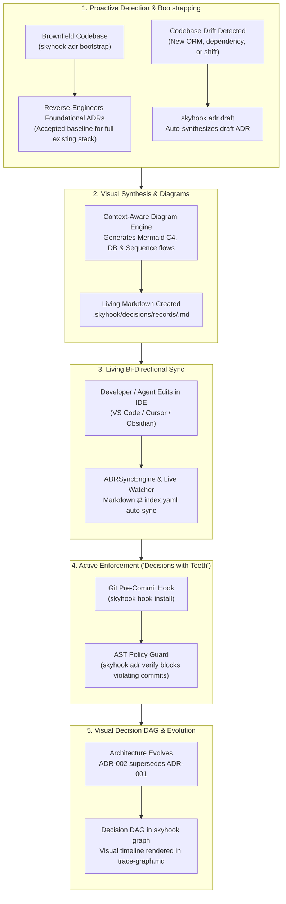

# Skyhook — Universal Project Intelligence & Architecture Governance for AI Agents

Persistent, structured, version-controlled project memory and active architectural governance for AI agents, stored in `.skyhook/` as plain Markdown and YAML files.

**Repository:** https://github.com/asadayoub/skyhook  
**Latest Release:** https://github.com/asadayoub/skyhook/releases/latest  
**Download:** https://github.com/asadayoub/skyhook/releases/latest/download/skyhook-skill.tar.gz

[](https://github.com/asadayoub/skyhook/releases)
[](LICENSE)
[](package.json)
[](#-agent-integration--native-slash-commands)

---

## 🚀 Quick Install

```bash
# One-liner installer (macOS/Linux/WSL)
curl -fsSL https://raw.githubusercontent.com/asadayoub/skyhook/main/install.sh | bash

# Add to PATH (if not already present)
echo 'export PATH="$HOME/.skyhook/skill/cli:$PATH"' >> ~/.zshrc
source ~/.zshrc

# Verify installation
skyhook version
# Output: "version": "1.5.2"
```

**Alternative: Download Release (no git required)**
```bash
mkdir -p ~/.skyhook
curl -fsSL https://github.com/asadayoub/skyhook/releases/latest/download/skyhook-skill.tar.gz | tar -xz -C ~/.skyhook
echo 'export PATH="$HOME/.skyhook/skill/cli:$PATH"' >> ~/.zshrc
source ~/.zshrc
```

---

## 🎯 CLI Commands Reference (`skyhook`)

| Command | Subcommands / Options | Description |
|---------|-----------------------|-------------|
| `skyhook init` | `[--profile=...] [--variant=...] [--force]` | Initialize `.skyhook/` in current project; auto-detects stack or uses profile |
| `skyhook adr bootstrap` | `[--status=...] [--overwrite]` | **Reverse-engineer baseline ADRs** for all discovered stack technologies in an existing repo |
| `skyhook adr draft` | `[--title=...] [--decision=...]` | Automatically draft an ADR when unrecorded packages or architectural drift are detected |
| `skyhook adr sync` | — | Bi-directionally sync living Markdown records (`decisions/records/*.md`) with `index.yaml` |
| `skyhook adr verify` | `[path]` | Scan codebase with AST engine to verify compliance against accepted ADR policies |
| `skyhook adr watch` / `skyhook watch` | — | Launch real-time background file watcher for instant sync on editor save |
| `skyhook hook install` | — | Install executable Git pre-commit hook to block commits violating ADR policies |
| `skyhook hook uninstall` | — | Non-destructively remove Skyhook Git pre-commit hook |
| `skyhook hook status` | — | Check status of Git repository and pre-commit hook installation |
| `skyhook graph` | — | Generate visual Mermaid architecture graph & Decision DAG (`.skyhook/trace-graph.md`) |
| `skyhook trace` | `<REQ-ID>` | Trace requirement to stories, decisions, and AST-parsed codebase references |
| `skyhook impact` | `<REQ-ID>` | Analyze blast radius, risk level (low/med/high), and affected files for a requirement |
| `skyhook untraced` | — | Surface implemented/in-progress requirements lacking code annotations |
| `skyhook coverage` | — | Calculate requirements and code traceability coverage percentages |
| `skyhook map-legacy` | `[--limit=N]` | Map untagged codebase symbols to candidate requirements |
| `skyhook sync` | — | Check drift across tech stack, requirements→stories coverage, and decisions |
| `skyhook decide` | `<title> <decision> <context>` | Record architectural decision with auto-generated ADR and Mermaid diagram |
| `skyhook plan` | — | Generate/update comprehensive `PROJECT_PLAN.md` with milestones and risks |
| `skyhook discover` | `[phase]` | Interactive requirements gathering workflow |
| `skyhook question` | `[category]` | Generate contextual questions for requirements |
| `skyhook standards` | `[category]` | Show applicable built-in engineering standards and project overrides |
| `skyhook dashboard` | `<start\|stop\|status>` | Start on-demand Web Dashboard HTTP server on port 4343 |
| `skyhook setup` | `<codex\|claude\|gemini\|copilot\|all>` | **Auto-configure agent harness native slash commands** |
| `skyhook profile` | `[name]` | Inspect profile details (tech stack, questions, scaffolds, variants) |
| `skyhook version` | — | Show version, protocol, Node runtime, and platform info |
| `skyhook help` | — | Show all available commands |

### Project Profiles & Variants

| Profile | Typical Tech Stack & Use Case | Supported Variants |
|---------|-------------------------------|--------------------|
| `web-app` | React, Next.js, Tailwind, Prisma | — |
| `api-service` | REST/GraphQL APIs, Fastify, Express, PostgreSQL | — |
| `cli-tool` | Command-line tools, Node.js, commander/yargs | — |
| `library` | NPM / PyPI packages, dual ESM/CJS build | — |
| `saas` | Multi-tenant SaaS with authentication and billing | `stripe-b2b`, `stripe-b2c`, `paddle-b2b` (pre-fills 15+ decisions) |
| `ai-agent` | LLM-powered applications, prompt chaining, vector DBs | — |

**Variant Example:**
```bash
skyhook init --profile=saas --variant=stripe-b2b
```
Pre-fills payments, auth, database, tenancy, email, and monitoring decisions into `.skyhook/`.

---

## 📋 Slash Commands (`skyhook-cmd` via stdio JSON)

All AI agents invoke Skyhook via stdio JSON protocol:
```bash
echo '{"command":"...","args":{}}' | skyhook-cmd
```

### Feature & Backlog Management
| Command | Args | Description |
|---------|------|-------------|
| `listCurrentFeatures` | `status?: all\|backlog\|in-progress\|done\|blocked` | List features with child stories, status badges, and blockers |
| `getFeature` | `id: string` | Retrieve full feature details and all child stories |
| `addFeature` | `title, description?, goal?, stories?: [...]` | Create new epic and child stories in `backlog/epics.yaml` |
| `getNextTask` | `assignee?: string` | Return highest priority ready story (WSJF) with rich context |
| `getBlockers` | — | List all blocked stories and documented blocker reasons |
| `updateStatus` | `storyId, status: backlog\|ready\|in-progress\|in-review\|done\|blocked\|cancelled` | Update story status and record timestamp |

### Architectural Decision Records (ADRs)
| Command | Args | Description |
|---------|------|-------------|
| `recordDecision` / `decide` | `title, decision, context, status?, category?, alternatives?, relatedRequirements?, consequences?, rationale?, enforcement?` | Generate living ADR with contextual Mermaid diagram and register in index |
| `bootstrapAdr` | `status?: string, overwrite?: boolean` | Reverse-engineer baseline ADRs for existing/brownfield codebases |
| `draftAdr` | `title?, decision?, context?` | Auto-detect stack shifts or draft a new candidate ADR |
| `syncAdr` | — | Bi-directionally sync `decisions/records/*.md` with `decisions/index.yaml` |
| `verifyAdr` | `path?: string` | Run AST policy guard against source files to detect rule violations |
| `watchAdr` | — | Run live filesystem watcher for instant auto-sync on editor save |

### Git Governance & Pre-Commit Hooks
| Command | Args | Description |
|---------|------|-------------|
| `hookInstall` | — | Install executable pre-commit hook in `.git/hooks/pre-commit` |
| `hookUninstall` | — | Remove Skyhook pre-commit hook cleanly |
| `hookStatus` | — | Return Git repository and hook installation status |

### AST Traceability, Impact & Graph
| Command | Args | Description |
|---------|------|-------------|
| `trace` | `id: string (REQ-XXX)` | Trace requirement to stories, decisions, and AST-parsed code references |
| `impact` | `id: string (REQ-XXX)` | Calculate blast radius, risk level, affected stories, decisions, and files |
| `untraced` | — | Find requirements marked implemented with no code annotations |
| `coverage` | — | Compute requirements and code traceability coverage percentages |
| `mapLegacy` | `limit?: number` | Suggest requirement mappings for untagged codebase symbols |
| `graph` | — | Generate visual Mermaid architecture graph & Decision DAG (`trace-graph.md`) |
| `sync` | — | Check code vs docs drift (tech stack vs package.json, reqs→stories) |

### Context, Discovery & Planning
| Command | Args | Description |
|---------|------|-------------|
| `getContext` | `topic?: string` | Retrieve aggregated context (features, decisions, reqs, tech stack) |
| `plan` | — | Generate or update comprehensive `PROJECT_PLAN.md` |
| `discover` | `phase?, answers?` | Phased discovery questions (init, vision, requirements, tech, ux) |
| `question` | `category?, limit?` | Contextual questions filtered by phase/category |
| `standards` | `category?` | List applicable standards with levels and overrides |
| `profile` | `name?` | Inspect profile specifications, variants, and defaults |
| `dashboard` | `action: start\|stop\|status` | Control web dashboard HTTP server (port 4343) |
| `batchCreate` | `items: [{type, data}]` | Bulk create features, stories, requirements, or decisions in a single call |
| `init` | `profile?, name?, description?, variant?, force?` | Initialize `.skyhook/` directory structure |
| `setup` | `agent: codex\|claude\|gemini\|copilot\|all` | Configure native agent harness integrations |
| `version` | — | Return version, protocol, Node, and environment info |
| `help` | — | Return command schema and documentation |

---

## 🏛️ Automated Architecture Decision System

Skyhook replaces write-once, forgotten ADR documentation with an active, automated lifecycle:



### 1. Reverse-Engineer Baseline ADRs (`skyhook adr bootstrap`)
When initializing Skyhook in an existing project, `skyhook adr bootstrap` scans your inferred codebase (frameworks, databases, ORMs, styling, deployment) and automatically synthesizes accepted, foundational ADRs with Mermaid diagrams and consequences. It guarantees **strict idempotency** so re-runs never duplicate decisions.

### 2. Living Bi-Directional Sync (`skyhook adr sync` & `skyhook watch`)
Edit any `.skyhook/decisions/records/<ID>.md` directly in VS Code, Cursor, or Obsidian. Status changes, context, and consequences automatically sync with `decisions/index.yaml`. Running `skyhook watch` enables real-time background sync on every file save.

### 3. Git Pre-Commit Architectural Enforcement (`skyhook hook install`)
ADRs can declare active policy rules (e.g. `prohibitedImports: ["axios"]`). Skyhook's `ASTPolicyGuard` scans source code and blocks git commits via `.git/hooks/pre-commit` if violations occur.

### 4. Decision DAG Visual Timeline (`skyhook graph`)
Generates `.skyhook/trace-graph.md` showing active accepted ADRs (🏛️), superseded ADRs (⚠️), draft ADRs (📝), supersession relationships (`== "superseded by" ==>`), requirement governance (`-. "governs" .->`), and code symbol links organized in clean vertical subgraphs.

---

## 🔍 AST Code Tracer Engine

Add simple annotations to any source file:
```typescript
// @skyhook-implements REQ-001 REQ-002
export class AuthService {
  async authenticate(email: string, password: string) {
    // ...
  }
}
```

The Babel-powered AST parser automatically tracks:
- Function declarations, arrow functions, classes, and exported methods.
- Bi-directional requirement-to-code traceability (`skyhook trace REQ-001`).
- Blast radius and impact estimation when requirements change (`skyhook impact REQ-001`).
- Implemented requirements missing code references (`skyhook untraced`).
- Legacy symbol mapping for existing brownfield repos (`skyhook map-legacy`).

---

## 🤖 Agent Integration — Native Slash Commands

### One-Command Setup
```bash
skyhook setup all
```

| Agent Harness | Command | Configuration Created | Native Agent Slash Commands |
|---------------|---------|-----------------------|-----------------------------|
| **Codex** | `skyhook setup codex` | `.codex/agents.md` | `/skyhook-listCurrentFeatures`, `/skyhook-getNextTask`, `/skyhook-trace REQ-001`, etc. |
| **Claude Code** | `skyhook setup claude` | `.claude/commands/skyhook-*.md` | `/skyhook-next`, `/skyhook-features`, `/skyhook-blockers`, `/skyhook-decide`, `/skyhook-trace REQ-001`, `/skyhook-impact REQ-001`, `/skyhook-sync`, `/skyhook-dashboard start` |
| **Gemini CLI** | `skyhook setup gemini` | `.gemini/functions/skyhook.js` + `settings.json` | Function declarations: `skyhook_get_next_task()`, `skyhook_trace()`, `skyhook_record_decision()`, etc. |
| **GitHub Copilot** | `skyhook setup copilot` | `.github/copilot-instructions.md` + `.vscode/tasks.json` | VS Code Tasks: "Skyhook: Next Task", "Skyhook: List Features", "Skyhook: Check Drift", "Skyhook: Start Dashboard" |
| **Google Antigravity** | Included | Built-in Skill & CLI | Direct CLI & skill protocol integration |

---

## 🏗 Project Structure (`.skyhook/`)

Created by `skyhook init`:

```
.skyhook/
├── project.yaml             # Project metadata, profile, version, and configuration
├── context.md               # Problem statement, solution overview, target audience
├── vision.md                # Product vision, KPIs, personas, user journeys
├── requirements/
│   ├── functional.yaml      # Functional reqs with user stories (REQ-001, REQ-002...)
│   ├── non-functional.yaml  # Performance, security, scalability, accessibility reqs
│   └── constraints.yaml     # Technical, budget, regulatory constraints
├── decisions/
│   ├── index.yaml           # Decision registry (status, category, supersedes, enforcement)
│   └── records/             # Living ADR Markdown files (<ULID>.md) with Mermaid diagrams
├── backlog/
│   └── epics.yaml           # Epics, child stories, acceptance criteria, WSJF priority
├── tech-stack.yaml          # Auto-discovered & recorded technology stack
├── ux/
│   └── styleguide.md        # Design system tokens, components, and patterns
├── standards/               # Project-specific standards overrides
├── PROJECT_PLAN.md          # Comprehensive delivery plan with phases and milestones
├── changelog.md             # Automated audit trail of all project mutations
└── trace-graph.md           # Generated visual Decision DAG & traceability graph
```

---

## 📊 Dashboard (On-Demand Web UI)

```bash
skyhook dashboard start      # Starts HTTP server at http://localhost:4343
skyhook dashboard status
skyhook dashboard stop
```

- **Zero runtime overhead**: Shuts down completely when stopped.
- Multi-project selector on disk.
- Interactive features, epics, and story status badges.
- Next priority task with acceptance criteria.
- Requirements, Decision registry, and tech stack inspector.

---

## 🔑 Key Principles

- **Zero runtime dependencies** — Pure Node.js ≥ 18 with ES modules.
- **Local-only & Git-friendly** — All `.skyhook/` files are plain Markdown and YAML, fully version-controlled.
- **Agent-agnostic** — Works identically across CLI, stdio JSON, and all major agent harnesses.
- **Decisions with Teeth** — Active AST policy checking and Git pre-commit enforcement.
- **Living Documentation** — Continuous bi-directional synchronization between code, markdown, and registries.

---

## 📄 License

MIT — see [LICENSE](LICENSE)
