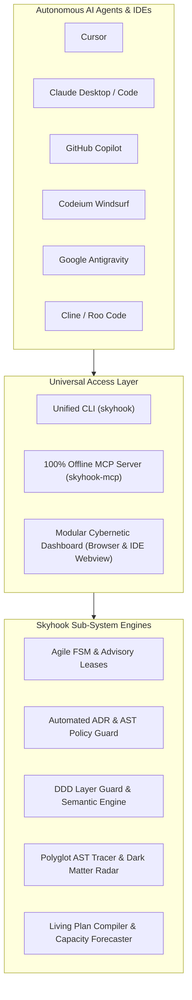

# Skyhook — Universal Project Intelligence & Architecture Governance for AI Agents

Persistent, structured, version-controlled project memory, active architectural governance, and real-time visual telemetry for AI agents and human engineering teams.

**Repository:** https://github.com/asadayoub/skyhook  
**Latest Release:** https://github.com/asadayoub/skyhook/releases/latest  

[](https://github.com/asadayoub/skyhook/releases)
[](LICENSE)
[](TESTING.md)
[](skyhook/docs/MCP_SERVER.md)
[](skyhook/docs/DASHBOARD_AND_IDE.md)
[](skyhook/docs/AGENT_HARNESSES.md)

---

## ⚡ The Problem

Autonomous AI coding agents are powerful but **stateless**. Every new prompt or context window starts from zero. They:
- Forget architectural decisions made yesterday
- Introduce conflicting, banned, or unvetted libraries
- Step on each other's toes with overlapping, concurrent changes
- Break domain boundaries (e.g. importing database drivers into UI components)
- Cannot maintain project knowledge across sessions or across different AI tools

## 🛡️ The Skyhook Solution

**Skyhook gives AI agents persistent project memory, advisory task leasing, and active architectural governance.**

```
┌─────────────────────────────────────────────────────────────┐
│  Without Skyhook          │  With Skyhook                   │
│───────────────────────────┼─────────────────────────────────│
│  Agent: "What database?"  │  Agent reads .skyhook/          │
│  User: "PostgreSQL"       │  Knows: PostgreSQL + Prisma     │
│  ...later...              │  ...later...                    │
│  Agent: "What database?"  │  Agent: "Using PostgreSQL with  │
│  User: "PostgreSQL"       │  ADR-002; claiming STORY-002"   │
└─────────────────────────────────────────────────────────────┘
```

---

## 🏛️ Core Capabilities


```mermaid
flowchart TD
    subgraph Agents["Autonomous AI Agents & IDEs"]
        Cursor["Cursor"]
        Claude["Claude Desktop / Code"]
        Copilot["GitHub Copilot"]
        Windsurf["Codeium Windsurf"]
        Antigravity["Google Antigravity"]
        Cline["Cline / Roo Code"]
    end

    subgraph Interface["Universal Access Layer"]
        CLI["Unified CLI (skyhook)"]
        MCP["100% Offline MCP Server (skyhook-mcp)"]
        Dashboard["Modular Cybernetic Dashboard (Browser & IDE Webview)"]
    end

    subgraph Core["Skyhook Sub-System Engines"]
        BacklogEngine["Agile FSM & Advisory Leases"]
        ADREngine["Automated ADR & AST Policy Guard"]
        DriftEngine["DDD Layer Guard & Semantic Engine"]
        TracerEngine["Polyglot AST Tracer & Dark Matter Radar"]
        PlanEngine["Living Plan Compiler & Capacity Forecaster"]
    end

    Agents --> Interface
    Interface --> Core
```

### 1. 🤖 100% Offline Model Context Protocol (MCP) Server
- Implements MCP Specification (2024-11-05) over stdio and loopback `127.0.0.1` SSE.
- Exposes **37 autonomous tools** across 8 operational domains (Core, Planning, Standards, Backlog, ADR, Drift, Plan, Trace).
- Exposes **11 streaming resources** (`skyhook://backlog`, `skyhook://plan`, `skyhook://decisions`, `skyhook://boundaries`, `skyhook://tech-stack`, `skyhook://standards`, `skyhook://blockers`, `skyhook://drift-scorecard`, `skyhook://dark-matter`, `skyhook://profile`, `skyhook://trace-graph`).
- Works natively with Cursor, Claude Desktop, Claude Code, GitHub Copilot, Windsurf, Google Antigravity, Cline, and OpenAI Codex without cloud relays.

### 2. 🔌 Poly-Agent Harness Injector
- Atomic, non-destructive configuration across 8 supported AI coding agents (`.cursor/rules/*.mdc`, `CLAUDE.md`, `.github/copilot-instructions.md`, `.windsurfrules`, `.agents/`, `.clinerules`, `.codex/agents.md`, and native `codex mcp add`).
- Non-destructive deep JSON merges for `mcp.json`, `settings.json`, and agent configs.
- Markdown marker blocks (`<!-- SKYHOOK_RULES_START -->`) preserve user customizations.

### 3. 🖥️ Modular Cybernetic Web Dashboard & Native IDE Extension
- Modular Multi-Page Application (MMPA) with zero build tools (native ES modules).
- Deep-link client hash router (`#/kanban`, `#/topology`, `#/drift`, `#/decisions`, `#/mermaid`, `#/dark-matter`, `#/harness`, `#/settings`).
- Sub-5ms reactive WebSocket push stream.
- Universal Platform Bridge runs identically in browsers and inside native VS Code / Cursor extension Webviews.

### 4. 🔀 Multi-Agent Agile Backlog & Advisory Leases
- Finite state machine: `backlog ➔ ready ➔ in-progress ➔ in-review ➔ done`.
- Prevents concurrent agent collisions via time-boxed advisory leases (`skyhook get-next-task --agent="Cursor"`).
- Append-only event ledger (`events.jsonl`) with Lead/Cycle time metrics and replay.

### 5. 🏛️ Automated ADR Engine & Active Policy Guard ("Decisions with Teeth")
- Reverse-engineers baseline ADRs for existing repositories (`skyhook adr bootstrap`).
- Complete ADR supersession lifecycle and visual Mermaid Decision DAG (`skyhook adr dag`).
- Compiles ADR text into AST import policies that reject prohibited packages before commit.

### 6. 🪝 Active Git Pre-Commit Governance
- `skyhook hook install` sets up `.git/hooks/pre-commit` to prevent developers or agents from committing code that violates accepted architectural decisions.

### 7. 🔍 Polyglot AST Code Tracer & Dark Matter Radar
- Polyglot support for **JavaScript / TypeScript, Python, Go, Rust, and Java**.
- AST symbol lineage tracking with fuzzy refactoring recovery.
- Tarjan's algorithm detecting circular dependency cycles in import graphs.
- Dark Matter Radar reporting untraced codebase symbols with risk tiers.

### 8. 📋 Living Project Plan Compiler & Capacity Forecaster
- Compiles `PROJECT_PLAN.md` with client-side Mermaid Gantt charts.
- Historical capacity planning with statistical P50 and P90 completion forecasts.

---

## 🚀 Quick Install

```bash
# One-liner installer (macOS/Linux/WSL)
curl -fsSL https://raw.githubusercontent.com/asadayoub/skyhook/main/install.sh | bash

# Add to PATH (if not already present)
echo 'export PATH="$HOME/.skyhook/skill/cli:$PATH"' >> ~/.zshrc
source ~/.zshrc

# Verify installation
skyhook version
```

---

## ⚡ 5-Minute Quickstart

```bash
# 1. Initialize in your project
skyhook init --name="Fintech Ledger" --profile=saas

# 2. Inject rules across all installed AI agents
skyhook harness inject --all

# 3. Launch the 100% offline MCP server
skyhook mcp --stdio &

# 4. Start the Cybernetic Web Dashboard
skyhook dashboard start --port 31415

# 5. Add an architectural requirement
skyhook add-feature "Double Entry Ledger" --points 5

# 6. Claim task as an AI agent
skyhook get-next-task --agent="Cursor-Cascade"

# 7. Record an architectural decision
skyhook decide "PostgreSQL with ACID Isolation" "Use PostgreSQL with Serializable Isolation"

# 8. Verify codebase compliance against accepted ADRs
skyhook adr verify

# 9. Recompile living master plan
skyhook plan
```

---

## 📚 Complete Documentation Suite

Comprehensive manuals and deep-dives are available in [`skyhook/docs/`](skyhook/docs/):

- 🏛️ **[System Architecture (v1.9.1)](skyhook/docs/ARCHITECTURE.md)**: System design, dataflow diagrams, and sub-system specifications.
- 📖 **[CLI Reference Manual](skyhook/docs/CLI_REFERENCE.md)**: Exhaustive reference for all 40+ commands, options, and JSON outputs.
- 🤖 **[100% Offline MCP Server Guide](skyhook/docs/MCP_SERVER.md)**: Setting up Cursor, OpenAI Codex, Claude Desktop, Windsurf, Antigravity, and Cline.
- 🖥️ **[Dashboard & Native IDE Extension Manual](skyhook/docs/DASHBOARD_AND_IDE.md)**: MMPA architecture, hash routing, and VS Code extension packaging.
- 🔌 **[Poly-Agent Harness Matrix](skyhook/docs/AGENT_HARNESSES.md)**: Non-destructive merging and rule synchronization.
- 🔍 **[Polyglot AST Traceability & Dark Matter](skyhook/docs/TRACEABILITY_AND_AST.md)**: Multi-language parsers, symbol lineage, and coverage radar.
- ⚖️ **[ADR Synthesis & Policy Governance](skyhook/docs/ADR_AND_GOVERNANCE.md)**: Decision DAG, supersession, and AST import guards.
- 🛠️ **Tutorials**:
  - [Tutorial 1: Zero to Governed Repository in 5 Minutes](skyhook/docs/TUTORIALS/01_QUICKSTART.md)
  - [Tutorial 2: Multi-Agent Task Coordination Without Collisions](skyhook/docs/TUTORIALS/02_MULTI_AGENT_WORKFLOW.md)
  - [Tutorial 3: Authoring Custom Language Parsers](skyhook/docs/TUTORIALS/03_CUSTOM_PARSERS.md)

---

## 🧪 Verification & Testing

Skyhook is thoroughly tested with **199 automated tests across 5 test suites**:
```bash
npm test
```

---

## 📄 License

MIT © [Asad Ayoub](https://github.com/asadayoub)
