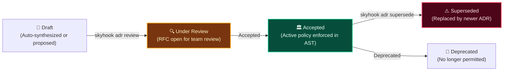
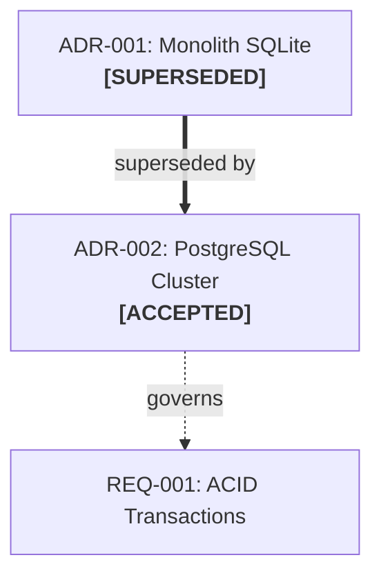

# Architectural Decision Records (ADRs) & Policy Governance

Skyhook provides an automated **Architectural Decision Record (ADR)** engine that transforms architectural decisions from passive text into **active, enforceable code boundary policies**.

---

## 1. ADR Lifecycle & Decision DAG

Architectural decisions evolve through a rigorous state machine:



### Visual Decision DAG
Run `skyhook adr dag` to generate the interactive Mermaid DAG visualizing decision lineages, supersession chains, and governed requirements:



---

## 2. Reverse-Engineering Brownfield Baselines

When introducing Skyhook to an existing codebase, running `skyhook adr bootstrap` inspects all installed packages, frameworks, database drivers, and configuration files, automatically generating baseline accepted ADRs:

```bash
skyhook adr bootstrap
```
Output:
```
✓ Bootstrapped 4 baseline ADRs:
  - ADR-001: Use React 18 for Frontend User Interface
  - ADR-002: Use PostgreSQL with Prisma ORM for Relational Storage
  - ADR-003: Use TypeScript Strict Mode for Type Safety
  - ADR-004: Use Express for REST API Service Layer
```

---

## 3. Active Policy Guard ("Decisions with Teeth")

Unlike static ADRs that sit in a wiki, Skyhook's [`ADRPolicyCompiler.js`](file:///Users/asad/Documents/Codex/2026-08-29/wh/skyhook-repo/skyhook/lib/adr/ADRPolicyCompiler.js) parses the decision text and compiles enforceable AST rules:

### Example Policy in ADR Markdown (`decisions/records/ADR-002.md`):
```markdown
## Invariants & Boundary Rules
- Prohibit import 'axios' in 'src/'
- Prohibit import 'sqlite3' in 'src/'
- Enforce import 'pg' only in 'src/infrastructure/db/'
```

### Verification via CLI:
```bash
skyhook adr verify
```
If an AI agent or human commits code importing `axios`, the policy guard halts the operation:
```
✖ ADR Policy Violation Detected!
  File: src/services/PaymentService.ts:4
  Rule: Prohibit import 'axios' (Governed by ADR-002: Use Native Fetch)
```

---

## 4. Git Pre-Commit Hook Integration

To guarantee that no rogue dependencies or architectural violations enter version control, install the pre-commit hook:

```bash
# Install hook
skyhook hook install

# Check status
skyhook hook status

# Uninstall if needed
skyhook hook uninstall
```

When installed in `.git/hooks/pre-commit`, git commits are automatically verified in `<50ms`. If an accepted ADR policy is violated, the commit is aborted.

---

## 5. Proactive Interception Daemon

Skyhook's [`ADRInterceptionDaemon.js`](file:///Users/asad/Documents/Codex/2026-08-29/wh/skyhook-repo/skyhook/lib/adr/ADRInterceptionDaemon.js) scans package manifests (`package.json`, `Cargo.toml`, `go.mod`, `requirements.txt`) and database migrations on `skyhook sync` or `skyhook adr intercept`.

When it detects an unrecorded library (e.g. `npm install redis`), it proactively drafts a candidate ADR:

```bash
$ skyhook adr intercept
⚠ Detected 1 unrecorded architectural package addition: 'ioredis'
✓ Auto-drafted candidate ADR: .skyhook/decisions/records/ADR-005.md (Status: DRAFT)
```
