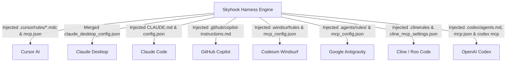

# Poly-Agent Harness Injector & Integration Guide

Skyhook features an extensible, atomic **Agent Harness Injector** that integrates project intelligence, architectural boundaries, and task management rules directly into the native runtime of AI coding agents.

---

## 1. Supported Agent Matrix



| Agent / Editor | Rules File Injected | MCP Config Injected | Detection Signature |
|---|---|---|---|
| **Cursor** | `.cursor/rules/skyhook.mdc` | `.cursor/mcp.json` | `.cursor/` directory or `cursor` binary |
| **Claude Desktop** | *N/A (Uses system prompt)* | `claude_desktop_config.json` | OS Application path |
| **Claude Code** | `CLAUDE.md` | `.claude/config.json` | `.claude/` or `claude` CLI |
| **GitHub Copilot** | `.github/copilot-instructions.md` | `.vscode/settings.json` | `.github/` or `.vscode/` |
| **Codeium Windsurf** | `.windsurfrules` | `.codeium/windsurf/mcp_config.json` | `.windsurf/` or `.codeium/` |
| **Google Antigravity**| `.agents/rules/skyhook-governance.md`| `.agents/mcp_config.json` | `.agents/` or `GEMINI.md` |
| **Cline / Roo Code** | `.clinerules` | `cline_mcp_settings.json` | `.clinerules` or VS Code extension |
| **OpenAI Codex** | `.codex/agents.md` & `AGENTS.md` | `.codex/mcp.json` & `~/.codex/config.toml` | `.codex/` directory, `AGENTS.md`, or `codex` CLI |

---

## 2. Safe Non-Destructive Merging

Skyhook never clobbers pre-existing developer configurations or third-party tools:

### Deep JSON Merge
When updating configuration files (like `.cursor/mcp.json` or `claude_desktop_config.json`), Skyhook parses existing JSON, injects or updates the `mcpServers.skyhook` key, and leaves all other servers, environment variables, and settings completely untouched.

### Markdown Marker Block Enclosure
In markdown instruction files (like `CLAUDE.md` or `.github/copilot-instructions.md`), Skyhook encloses its generated rules between clear comment markers:

```markdown
# Existing User Instructions

<!-- SKYHOOK_RULES_START -->
## Skyhook Architectural Governance Rules
- Check out tasks using `skyhook_get_next_task`
- Follow accepted ADR policies in `.skyhook/decisions/`
- Annotate implemented code with `// @skyhook-implements REQ-XXX`
<!-- SKYHOOK_RULES_END -->

# Other Custom User Guidelines
```

Calling `skyhook harness inject` refreshes only the text between the markers. Calling `skyhook harness remove` cleanly deletes the block, preserving surrounding content.

---

## 3. CLI Commands

```bash
# 1. Scan repository and operating system for active agents
skyhook harness detect

# 2. Check current injection health across all 8 agents
skyhook harness status

# 3. Dry-run planned file changes without modifying disk
skyhook harness inject --dry-run

# 4. Inject into specific agents
skyhook harness inject --target=cursor,windsurf

# 5. Inject into all detected agents in one command
skyhook harness inject --all

# 6. Clean rollback
skyhook harness remove --target=cursor
```

---

## 4. Automated Bidirectional Sync (`skyhook sync`)

Whenever architectural decisions are accepted, requirements evolve, or tech stacks are updated, running `skyhook sync` automatically refreshes the rules blocks across all active agent instruction files:

```bash
$ skyhook sync
✅ No architecture drift detected.
📋 Project Plan recompiled: .skyhook/plan/PROJECT_PLAN.md updated.
🤖 Agent Harness Sync: Refreshed governance rules across 2 agent(s) (cursor, windsurf).
```
