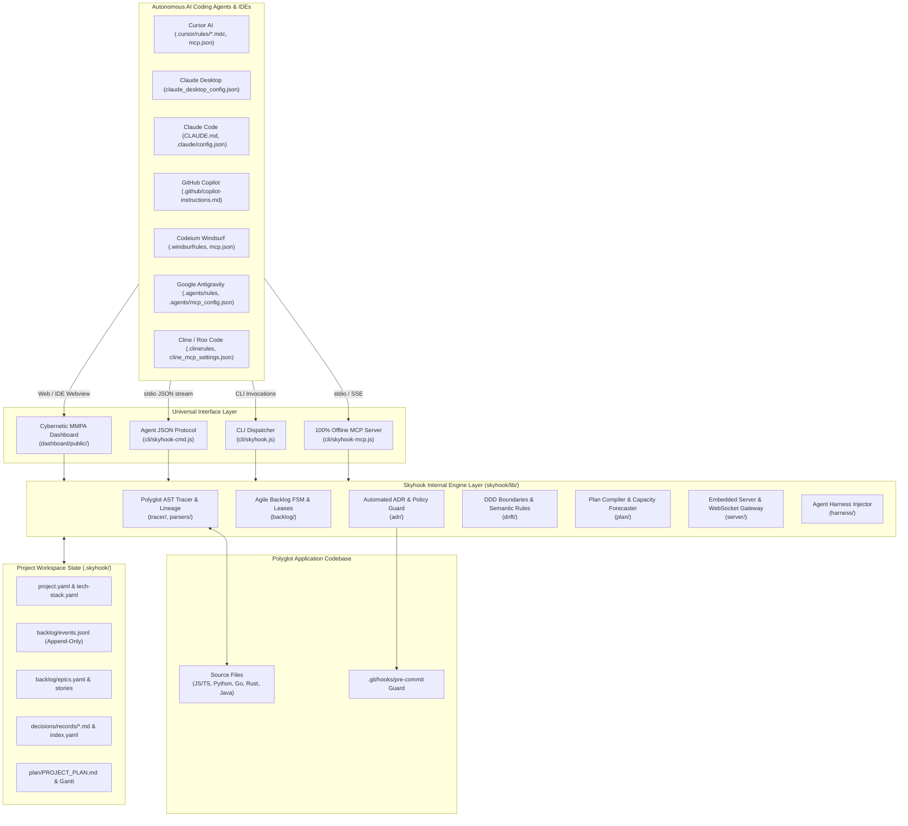
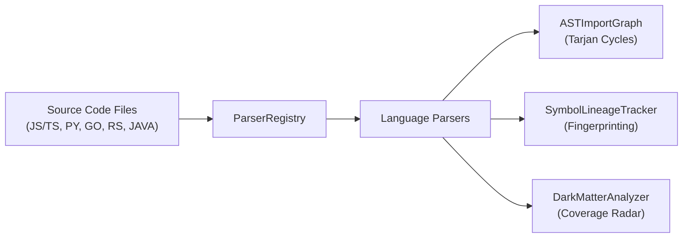
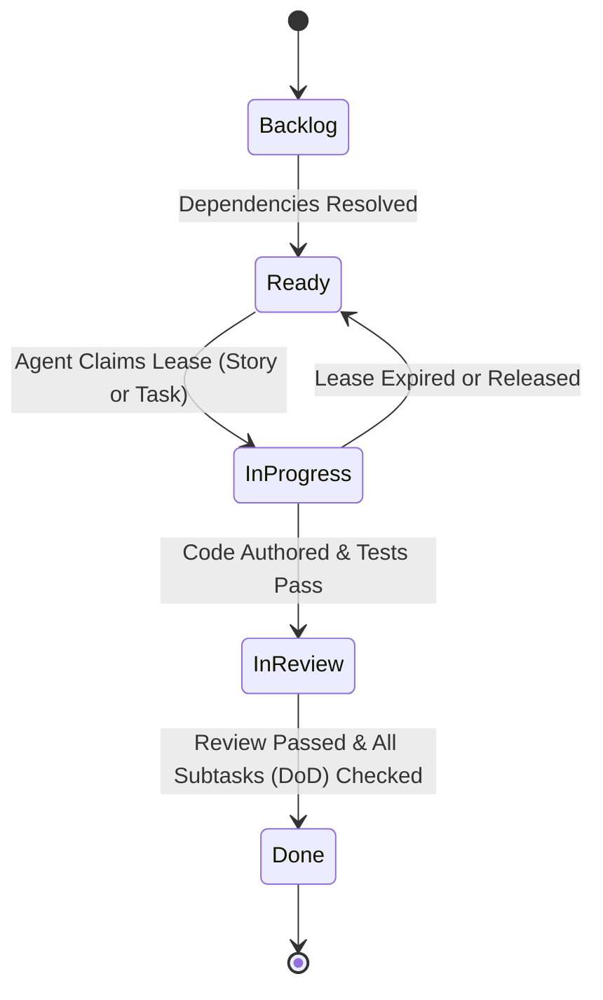
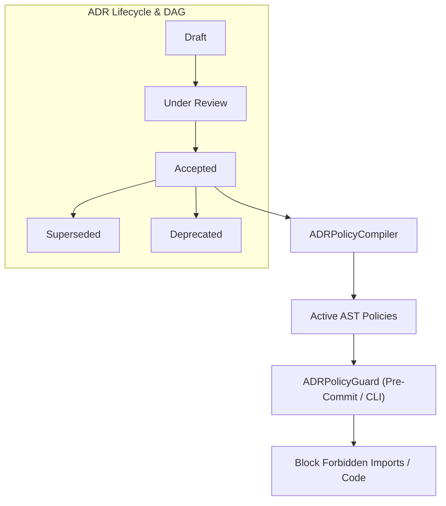
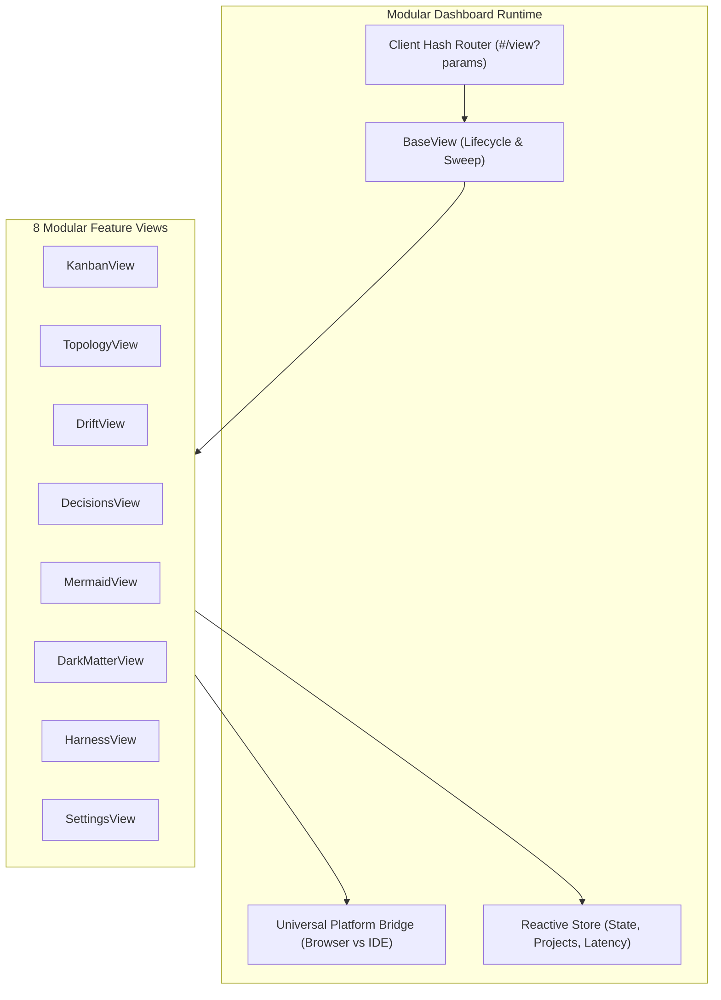

# Skyhook Architecture (v1.9.1)

Universal Project Intelligence & Architecture Governance for Autonomous AI Agents and Engineering Teams.

---

## 1. System Overview & Philosophy

Skyhook operates on a foundational premise: **AI coding agents are powerful but stateless, while complex software engineering demands persistent architectural memory, continuous traceability, and strict boundary governance.**



### Core Tenets
1. **100% Offline & Local-First**: Zero external network requests, zero cloud relays, and zero telemetry. Operates completely air-gapped on `127.0.0.1`.
2. **Zero Native Build Tools**: Zero `node-gyp`, Python compilation steps, or C++ dependencies. Skyhook uses pure ES modules and pure JavaScript AST parsers.
3. **Dual-Environment Architecture**: The cybernetic dashboard runs identically in standard browsers via HTTP/WebSocket and inside VS Code / Cursor / Windsurf Webview panels via `window.postMessage`.
4. **Advisory Multi-Agent Leases**: Prevents concurrent AI agent collisions through time-boxed advisory leases, automated prerequisite cascades, and dependency locks.
5. **Continuous Markdown ⇄ YAML Synchronization**: Markdown files for humans and structured YAML/JSON for agents stay in bidirectional real-time sync.

---

## 2. Core Engine Internals

### 2.1 AST Code Tracer & Polyglot Parsers
- **Location**: [`skyhook/lib/tracer/`](file:///Users/asad/Documents/Codex/2026-08-29/wh/skyhook-repo/skyhook/lib/tracer/), [`skyhook/lib/parsers/`](file:///Users/asad/Documents/Codex/2026-08-29/wh/skyhook-repo/skyhook/lib/parsers/)
- **Mechanism**:
  - `ParserRegistry.js`: Coordinates language-specific parsers with dynamic priority matching. Allows runtime registration of custom user parsers placed in `.skyhook/parsers/`.
  - **Polyglot Parsers**:
    - **JavaScript / TypeScript**: Built with `@babel/parser` and `@babel/traverse`. Parses ES modules, CommonJS, React JSX/TSX, TypeScript interfaces, and docblock annotations (`// @skyhook-implements REQ-001`).
    - **Python** (`PythonParser.js`): Extracts classes, methods, async defs, docstrings, decorators, and `# @skyhook-implements` tags.
    - **Go** (`GoParser.js`): Extracts package functions, receiver methods, structs, interfaces, and comment tags.
    - **Rust** (`RustParser.js`): Extracts structs, traits, `impl` blocks, and `/// @skyhook-implements` tags.
    - **Java** (`JavaParser.js`): Extracts classes, records, interfaces, methods, and `@SkyhookImplements("REQ-001")` annotations.
  - `SymbolLineageTracker.js`: Generates AST symbol fingerprints. When files are refactored or methods renamed, it computes Levenshtein distance and token similarity across candidate symbols to detect broken lineage and suggest recoveries.
  - `ASTImportGraph.js`: Builds the directed module import graph and detects circular dependencies using **Tarjan's strongly connected components algorithm**.
  - `DarkMatterAnalyzer.js`: Surfaces untraced codebase symbols, categorizing them into risk tiers (`Critical`, `High`, `Medium`, `Low`) and computing traceability coverage percentages.



---

### 2.2 Agile Backlog FSM, Two-Tier Leases & Event Ledger
- **Location**: [`skyhook/lib/backlog/`](file:///Users/asad/Documents/Codex/2026-08-29/wh/skyhook-repo/skyhook/lib/backlog/)
- **Hierarchy & Decomposition**:
  $$\text{Epic} \longrightarrow \text{Story} \longrightarrow \text{Task} \longrightarrow \text{Subtask (DoD)}$$
  - Epics can also directly own technical chores, architectural spikes, and infrastructure tasks (`TASK-XXX`).
- **Core Components**:
  - `BacklogStateMachine.js`: Enforces the 5-stage lifecycle across both stories and tasks:
    $$\text{backlog} \longrightarrow \text{ready} \longrightarrow \text{in-progress} \longrightarrow \text{in-review} \longrightarrow \text{done}$$
    - **Hierarchical Bottom-Up Rollups**:
      - When the first child task transitions to `in-progress`, its parent story automatically advances to `in-progress`.
      - When all child tasks reach `done`, the parent story automatically advances to `in-review`.
      - When all stories and direct tasks under an epic reach `done`, the parent epic transitions to `done`.
    - **Definition of Done (DoD) Checklist Invariants**: Any incomplete subtask (`SUB-XXX`) blocks its parent task or story from transitioning to `done`.
  - `TaskLeaseManager.js`: Implements the **Two-Tier Multi-Agent Locking System**:
    - **Task-Level Concurrency**: Grants time-boxed advisory leases on specific tasks (`TASK-XXX`). Sibling tasks under the same story can be leased concurrently by different AI agents (`assignee: "Cursor-Cascade"`, `assignee: "Codex"`) without collision.
    - **Story-Level Exclusive Locks**: Acquiring an exclusive story lease verifies that no child tasks are leased by other agents.
    - **Lease Heartbeats & Dual Sweep**: Agents can extend active leases using `skyhook task heartbeat` / `skyhook_heartbeat_lease`. Expired story and task leases are automatically reclaimed on sweep.
    - **AST Target File Overlap Prevention**: Inspects `targetFiles` across concurrently active leases and emits warnings when multiple agents plan modifications to the same source files.
  - `DependencyResolver.js`: Resolves DAG prerequisites across stories and tasks (`dependsOn: ["STORY-001", "TASK-002"]`), preventing items from entering `ready` until blockers reach `done`.
  - `EventLedger.js`: Append-only event ledger in `.skyhook/backlog/events.jsonl` recording 8 granular lifecycle events (`TASK_CREATED`, `TASK_LEASED`, `TASK_STATE_TRANSITIONED`, `SUBTASK_TOGGLED`, etc.) for historical replay and exact Lead/Cycle time metrics.
  - `BacklogLock.js`: Cross-process advisory lock file (`.skyhook/backlog/.lock`) with stale-lock detection and automatic recovery.
  - `GitLifecycleSync.js`: Monitors git branch checkouts (e.g. `feature/TASK-003-auth`) and commit messages (e.g. `fix: complete TASK-003 [closes TASK-003]`), automatically driving FSM state transitions.



---

### 2.3 Automated ADR Engine & Boundary Guard
- **Location**: [`skyhook/lib/adr/`](file:///Users/asad/Documents/Codex/2026-08-29/wh/skyhook-repo/skyhook/lib/adr/)
- **Mechanism**:
  - `ADRSynthesizer.js`: Generates structured architectural decision records with auto-generated Mermaid diagrams and comparative diffs.
  - `ADRSupersessionEngine.js`: Manages the decision lifecycle:
    $$\text{draft} \longrightarrow \text{under-review} \longrightarrow \text{accepted} \longrightarrow \text{superseded} \longrightarrow \text{deprecated}$$
    Injects clear warning callouts into superseded ADR files, links target replacement ADRs, and recalculates the Mermaid Decision DAG.
  - `ADRPolicyCompiler.js` & `ADRPolicyGuard.js`: Extracts enforceable boundary rules from ADR text (e.g., `Prohibit import 'axios' in 'services/'`). Scans the AST of all source files during verification and pre-commit hooks to halt violations.
  - `ADRInterceptionDaemon.js`: Scans repository package manifests (`package.json`, `requirements.txt`, `Cargo.toml`, `go.mod`) and database migrations to detect unrecorded architectural changes and auto-drafts candidate ADRs.
  - `ADRSyncEngine.js` & `ADRWatcher.js`: Maintains 2-way consistency between Markdown records in `decisions/records/*.md` and `.skyhook/decisions/index.yaml` with a 60ms debounced file watcher.



---

### 2.4 Architecture Drift, DDD Boundaries & Semantic Rules
- **Location**: [`skyhook/lib/drift/`](file:///Users/asad/Documents/Codex/2026-08-29/wh/skyhook-repo/skyhook/lib/drift/)
- **Mechanism**:
  - `ModuleBoundaryGuard.js`: Enforces Domain-Driven Design (DDD) layer boundaries. Verifies that inner layers (`domain/`) never import from outer layers (`infrastructure/` or `ui/`).
  - `SemanticRuleEngine.js`: Performs AST code hygiene checks:
    - Flags direct `process.env` access outside configuration directories.
    - Flags raw SQL / unparameterized queries in HTTP controller layers.
    - Flags unstructured `console.log` statements in production services.
  - `C4ArchitectureGenerator.js`: Reverse-engineers C4 Container and Component models from directory trees and import graphs, comparing them against the baseline in `project.yaml`.
  - `DriftAutoFixer.js` & `DriftAggregator.js`: Computes an Architectural Compliance Health Score ($0-100\%$) and provides a 1-click adoption action to update `tech-stack.yaml` and draft an ADR.

---

### 2.5 Project Plan Compiler & Capacity Forecaster
- **Location**: [`skyhook/lib/plan/`](file:///Users/asad/Documents/Codex/2026-08-29/wh/skyhook-repo/skyhook/lib/plan/)
- **Mechanism**:
  - `PlanCompiler.js`: Compiles the master living plan `.skyhook/plan/PROJECT_PLAN.md`. Aggregates project vision, architecture overview, backlog epics/stories, delivery forecasts, and Gantt charts.
  - `GanttGenerator.js`: Generates Mermaid Gantt syntax (`gantt ... dateFormat YYYY-MM-DD`) with sectioned epics, story durations, and milestone markers.
  - `ScopedPlanGenerator.js`: Emits detailed individual requirement plans (`.skyhook/plan/requirements/REQ-*.md`) and epic plans (`.skyhook/plan/epics/EPIC-*.md`).
  - `CapacityPlanner.js`: Evaluates historical event velocity from `events.jsonl`. Computes rolling velocity, remaining story points, scope creep metrics, and statistical P50 and P90 projected delivery dates.

---

### 2.6 Embedded Server, WebSocket Gateway & File RPC
- **Location**: [`skyhook/lib/server/`](file:///Users/asad/Documents/Codex/2026-08-29/wh/skyhook-repo/skyhook/lib/server/)
- **Mechanism**:
  - `SkyhookServer.js`: Offline HTTP server with automatic port-hunting starting at 31415 (`31415`, `31416`, `31417`, ...). Serves static SPA dashboard assets and REST/RPC endpoints:
    - `GET /api/projects`: Discovers local workspace and all global projects tracked in `~/.skyhook`.
    - `GET /api/project?id=...`: Retrieves unified project state, capacity, backlog, and drift.
    - `GET /api/file?path=...`: Securely serves project source files with strict directory traversal prevention (`403 Forbidden` if path escapes workspace).
    - `GET /api/dark-matter`: Serves AST coverage metrics and untraced symbols.
    - `GET /api/harness/detect`: Returns active and detected AI agent configurations.
    - `POST /api/action/*`: Executes transactional actions (`update-status`, `release-lease`, `adopt-drift`, `recompile-plan`, `open-editor`, `inject-harness`, `remove-harness`).
  - `WebSocketGateway.js`: Broadcasts real-time events over `ws://127.0.0.1:<port>/ws` with sub-5ms latency. Features unreferenced heartbeat ping/pongs that measure client connection latency and prevent dangling node processes.
  - `DashboardWatcher.js`: Observes `.skyhook/` directory mutations with 60ms debouncing, pushing reactive updates to all connected browser and IDE clients.

---

### 2.7 Modular Multi-Page Cybernetic Dashboard (MMPA)
- **Location**: [`skyhook/dashboard/public/`](file:///Users/asad/Documents/Codex/2026-08-29/wh/skyhook-repo/skyhook/dashboard/public/)
- **Mechanism**:
  - Built with **native browser ES Modules** (`<script type="module" src="/main.js">`). Requires **zero bundlers**, zero Webpack, and zero build commands.
  - **Universal Platform Bridge** (`core/Bridge.js`, `BrowserBridge.js`, `VSCodeBridge.js`): Automatically detects whether it is running in a browser or inside a VS Code / Cursor Webview. Routes RPC calls through `fetch`/WebSocket or `acquireVsCodeApi().postMessage`.
  - **Deep-Link Hash Router** (`core/Router.js`): Maps `#/kanban`, `#/topology`, `#/drift`, `#/decisions`, `#/mermaid`, `#/dark-matter`, `#/harness`, and `#/settings`. Parses query parameters (`#/decisions?id=ADR-001`) and gracefully falls back on 404 routes.
  - **Lifecycle Engine** (`core/BaseView.js`): Orchestrates `mount()`, `postRender()`, `update()`, and `unmount()`. Automatically sweeps all active timers and store subscriptions on navigation to prevent memory leaks.
  - **IDE Packaging Manifest** (`ide/ExtensionManifest.json`): Outlines the exact CSP, message schemas, and webview configurations required to package the dashboard into a `.vsix` extension.



---

### 2.8 100% Offline MCP Server & Poly-Agent Harness Injector
- **Location**: [`skyhook/lib/harness/`](file:///Users/asad/Documents/Codex/2026-08-29/wh/skyhook-repo/skyhook/lib/harness/), [`skyhook/cli/skyhook-mcp.js`](file:///Users/asad/Documents/Codex/2026-08-29/wh/skyhook-repo/skyhook/cli/skyhook-mcp.js)
- **Mechanism**:
  - Implements the official **Model Context Protocol (MCP) specification (2024-11-05)** over pure JSON-RPC 2.0.
  - **Transports**:
    - `StdioTransport.js`: Pipes JSON-RPC messages over standard I/O. Redirects `console.log` to `process.stderr` to keep `stdout` pristine for client parsing.
    - `SSETransport.js`: Local HTTP loopback server listening on `127.0.0.1` serving `/sse` streams and `/messages` session endpoints.
  - **44 Autonomous MCP Tools**: Partitioned across 8 domains (Core, Planning, Standards, Backlog, ADR, Drift, Plan, Trace).
  - **11 Streaming MCP Resources**: `skyhook://backlog`, `skyhook://plan`, `skyhook://decisions`, `skyhook://boundaries`, `skyhook://tech-stack`, `skyhook://standards`, `skyhook://blockers`, `skyhook://drift-scorecard`, `skyhook://dark-matter`, `skyhook://profile`, and `skyhook://trace-graph`.
  - **2 MCP Prompts**: `task_kickoff`, `architecture_review`.
  - **Poly-Agent Harness Matrix**:
    - **Cursor**: Generates `.cursor/rules/skyhook.mdc` and merges `.cursor/mcp.json`.
    - **Claude Desktop**: Configures OS-specific `claude_desktop_config.json`.
    - **Claude Code**: Injects `CLAUDE.md` and `.claude/config.json`.
    - **GitHub Copilot**: Injects `.github/copilot-instructions.md` and `.vscode/settings.json`.
    - **Windsurf**: Injects `.windsurfrules` and `.codeium/windsurf/mcp_config.json`.
    - **Google Antigravity**: Injects `.agents/rules/skyhook-governance.md` and `.agents/mcp_config.json`.
    - **Cline / Roo Code**: Injects `.clinerules` and global `cline_mcp_settings.json`.
    - **OpenAI Codex**: Injects `.codex/agents.md` & `AGENTS.md`, `.codex/mcp.json` & `~/.codex/config.toml`, and auto-registers via `codex mcp add`.
  - **Non-Destructive Merging**: Encloses markdown rules in `<!-- SKYHOOK_RULES_START --> ... <!-- SKYHOOK_RULES_END -->` and performs deep recursive JSON object merges without clobbering user configs.

---

### 2.9 Modular Engineering Standards System
- **Location**: [`skyhook/lib/standards/`](file:///Users/asad/Documents/Codex/2026-08-29/wh/skyhook-repo/skyhook/lib/standards/)
- **Mechanism**:
  - `StandardsRegistry.js`: Multi-tiered catalog discovering 16+ built-in standards and workspace-custom standards (`.skyhook/standards/`).
  - `StandardsResolver.js`: Compiles concise LLM agent briefings injected into backlog tasks, ADRs, and prompt contexts.
  - `StandardsPackageInstaller.js`: Scaffolds custom engineering standards and imports shared team standards bundles.
  - Dynamically binds declarative compliance rules into `SemanticRuleEngine.js` during AST drift audits.

---

## 3. Storage & State Schema (`.skyhook/`)

```
.skyhook/
├── project.yaml                     # Project metadata, profile declaration, and standards
├── tech-stack.yaml                  # Declared vs inferred dependencies and libraries
├── requirements/
│   ├── functional.yaml              # User stories, acceptance criteria, WSJF priorities
│   ├── non-functional.yaml          # Performance, security, accessibility criteria
│   └── constraints.yaml             # Architectural, business, and regulatory constraints
├── backlog/
│   ├── epics.yaml                   # Epics, direct tasks, stories, child tasks, & DoD subtasks
│   ├── events.jsonl                 # Append-only event ledger for FSM replay & metrics
│   └── .lock                        # Cross-process advisory lock file
├── decisions/
│   ├── index.yaml                   # Fast registry of all ADR metadata and statuses
│   └── records/                     # Rich Markdown ADR files
│       ├── ADR-001.md
│       └── ADR-002.md
├── standards/                       # Workspace-custom engineering standards
│   └── custom-standard.yaml
├── plan/
│   ├── PROJECT_PLAN.md              # Living compiled master plan with Mermaid Gantt
│   ├── requirements/                # Scoped requirement plans
│   └── epics/                       # Scoped epic plans
├── trace-graph.md                   # Visual architecture & Decision DAG (Mermaid)
├── harness-manifest.json            # Injected agent harness registry & timestamps
└── changelog.md                     # Automated audit log of requirements and state changes
```

---

## 4. Verification & Testing Standards

Skyhook maintains 100% offline automated test suites with **207 comprehensive tests across 6 test suites**:
- **Zero Network Invocations**: Tests use local filesystem fixtures (`os.tmpdir()`) and loopback servers (`127.0.0.1`).
- **Clean Teardowns**: Tests shut down HTTP/WebSocket servers and clean up temporary workspaces on completion to prevent dangling handles.
- **Run the full test suite**:
  ```bash
  npm test
  ```
