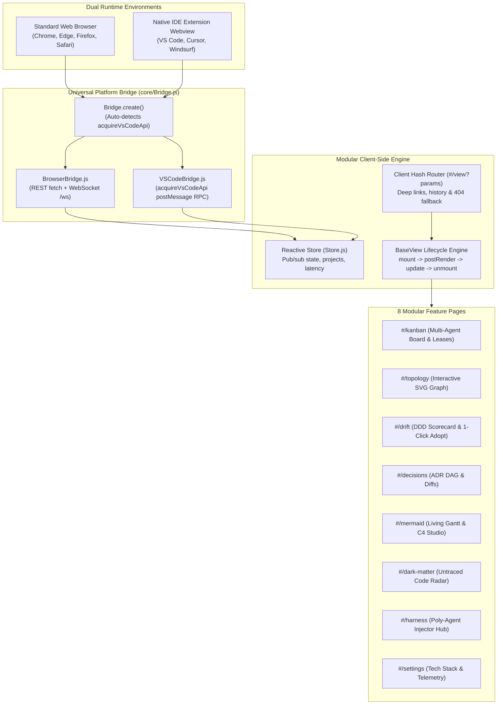

# Cybernetic Web Dashboard & Native IDE Extension Integration

Skyhook features a high-performance **Modular Multi-Page Application (MMPA)** dashboard designed with a cyberpunk HUD aesthetic. It runs both as a standalone browser application (with `<5ms` live WebSocket updates) and embedded directly inside **VS Code, Cursor, and Windsurf Webview panels**.

---

## 1. Architectural Design



### Zero-Build Architecture
In alignment with Skyhook's philosophy, the frontend requires **zero bundlers, zero Webpack/Vite build steps, and zero compilation**. It runs standard native browser ES Modules directly:
```html
<script type="module" src="/main.js"></script>
```

---

## 2. Universal Platform Bridge

The platform bridge abstracts communication so that UI components and views are completely decoupled from the runtime host:

```javascript
import { Bridge } from './core/Bridge.js';

// Auto-selects BrowserBridge or VSCodeBridge
const bridge = Bridge.create();
bridge.init();

// Unified RPC call (works identically in browser or IDE)
const { projects } = await bridge.get('/api/projects');

// Deep-link to open file in editor
await bridge.openEditor('src/ledger/LedgerService.ts', 42);
```

### BrowserBridge (`core/BrowserBridge.js`)
- Communicates with `SkyhookServer.js` via REST `fetch()` and `WebSocketGateway.js` (`ws://127.0.0.1:<port>/ws`).
- Auto-reconnects on connection drops with exponential backoff.
- Features unreferenced heartbeat pings measuring real-time round-trip latency (`< 5ms`).

### VSCodeBridge (`core/VSCodeBridge.js`)
- Detects `acquireVsCodeApi()` or `window.__VSCODE_WEBVIEW__`.
- Posts structured JSON messages to the Extension Host:
  ```json
  { "type": "RPC_REQUEST", "id": "req-1", "action": "GET_PROJECT_DATA", "payload": {} }
  ```
- Handles `OPEN_DOCUMENT` to open files in editor tabs at the exact line number.

---

## 3. Client-Side Hash Router & Deep Linking

Skyhook uses **Hash-based client routing** (`#/view`) because hash routing functions identically in standard web browsers and inside IDE Webviews without requiring server-side URL rewrite rules.

### Route Mapping:
| Route | Page | Description |
|---|---|---|
| `#/kanban` | Kanban View | Multi-agent Agile board with live lease countdown timers. |
| `#/topology` | Topology View | Interactive SVG architecture and traceability graph. |
| `#/drift` | Drift Center | DDD layer violation scorecard and 1-click auto-adoption. |
| `#/decisions` | Decisions DAG | Interactive ADR graph with comparative diff viewer. |
| `#/mermaid` | Mermaid Studio | Client-side Gantt charts and 1-click plan recompilation. |
| `#/dark-matter` | Dark Matter Radar | Untraced AST code radar, heatmap, and risk tiers. |
| `#/harness` | Harness Center | Poly-agent injector hub and offline MCP status across 8 supported AI coding agents (Cursor, Claude, Copilot, Windsurf, Antigravity, Cline, OpenAI Codex). |
| `#/settings` | Settings View | Workspace telemetry, profile specs, and editor preferences (VS Code, Cursor, Windsurf, Sublime Text, Modal Viewer). |

### Query Parameter Support:
Deep links can target specific items directly:
```
http://127.0.0.1:31415/#/decisions?id=ADR-002
http://127.0.0.1:31415/#/drift?filter=critical
```

---

## 4. BaseView Lifecycle & Resource Sweeping

To prevent memory leaks when switching between views, every page extends `BaseView.js`:

```javascript
import { BaseView } from '../core/BaseView.js';

export class CustomView extends BaseView {
  render() {
    return `<div class="glass-panel">Custom View</div>`;
  }

  async postRender() {
    // 1. Register interval timer (automatically cleared on unmount)
    const timer = setInterval(() => this.tick(), 1000);
    this.registerTimer(timer);

    // 2. Register store subscription (automatically cleared on unmount)
    const unsub = this.store.subscribe('activeProject', () => this.refresh());
    this.registerSubscription(unsub);
  }

  async update(projectData) {
    // Reactive update triggered by server WebSocket broadcast
  }
}
```

---

## 5. Native IDE Extension Packaging Specification

The file [`skyhook/dashboard/public/ide/ExtensionManifest.json`](file:///Users/asad/Documents/Codex/2026-08-29/wh/skyhook-repo/skyhook/dashboard/public/ide/ExtensionManifest.json) specifies the exact contract for packaging the dashboard into a VS Code or Cursor extension:

```json
{
  "name": "skyhook-ide-webview",
  "version": "1.9.1",
  "contentSecurityPolicy": {
    "defaultSrc": ["'none'"],
    "scriptSrc": ["'self'", "https://cdn.jsdelivr.net/npm/mermaid@10/dist/mermaid.min.js", "'unsafe-eval'", "'unsafe-inline'"],
    "styleSrc": ["'self'", "'unsafe-inline'"],
    "connectSrc": ["'self'", "http://127.0.0.1:*", "ws://127.0.0.1:*"]
  },
  "entrypoint": {
    "html": "skyhook/dashboard/public/index.html",
    "script": "skyhook/dashboard/public/main.js",
    "styles": ["skyhook/dashboard/public/cyber.css"]
  }
}
```

### Packaging into a VS Code Extension (`extension.ts` snippet):
```typescript
import * as vscode from 'vscode';
import * as path from 'path';

export function activate(context: vscode.ExtensionContext) {
  context.subscriptions.push(
    vscode.commands.registerCommand('skyhook.openDashboard', () => {
      const panel = vscode.window.createWebviewPanel(
        'skyhookDashboard',
        'Skyhook // Architecture Radar',
        vscode.ViewColumn.One,
        { enableScripts: true, retainContextWhenHidden: true }
      );

      const htmlPath = path.join(context.extensionPath, 'skyhook/dashboard/public/index.html');
      // Load html and rewrite script/style URIs via panel.webview.asWebviewUri()
    })
  );
}
```

---

## 6. Starting & Controlling the Dashboard

```bash
# Start on default port (auto-hunts starting at 31415)
skyhook dashboard start

# Start on specific port
skyhook dashboard start --port 4000

# Check running status & PID
skyhook dashboard status

# Stop background server
skyhook dashboard stop
```
