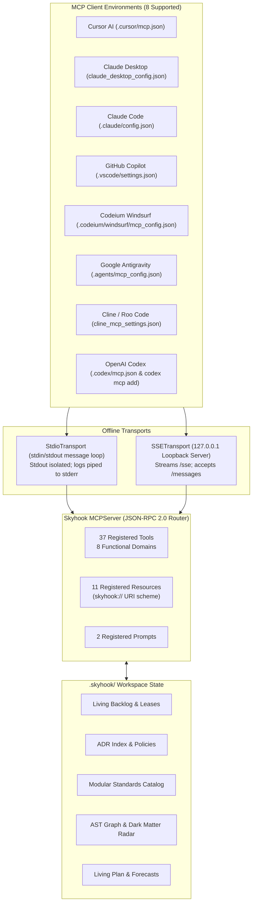

# Skyhook Model Context Protocol (MCP) Server

Skyhook provides a native, **100% offline Model Context Protocol (MCP)** server compliant with the official MCP specification (2024-11-05). It exposes project intelligence, living backlog tasks, architectural rules, engineering standards, and AST traceability directly into the runtime of AI coding agents.

---

## 1. Architectural Highlights



- **100% Air-Gapped & Offline**: Operates strictly on `process.stdin`/`process.stdout` or local loopback `127.0.0.1`. No data leaves your machine.
- **Pure JavaScript & Zero Compilation**: Zero native dependencies (`node-gyp` free).
- **Stream Isolation**: Console logging is redirected to `process.stderr` during active stdio sessions, ensuring `stdout` remains pure, uncorrupted JSON-RPC 2.0.

---

## 2. Quick Start & Client Configurations

Launch via the standalone binary:
```bash
skyhook-mcp
```
Or via the unified CLI:
```bash
skyhook mcp --stdio
```

### Cursor AI
Add to `.cursor/mcp.json`:
```json
{
  "mcpServers": {
    "skyhook": {
      "command": "node",
      "args": ["./node_modules/@skyhook/skill/skyhook/cli/skyhook-mcp.js"]
    }
  }
}
```
*Tip: Run `skyhook harness inject --target=cursor` to auto-configure this file.*

### OpenAI Codex
Run via native CLI registration:
```bash
codex mcp add skyhook -- node /ABSOLUTE/PATH/TO/skyhook/cli/skyhook-mcp.js
```
Or add to `.codex/mcp.json`:
```json
{
  "mcpServers": {
    "skyhook": {
      "command": "node",
      "args": ["./node_modules/@skyhook/skill/skyhook/cli/skyhook-mcp.js"]
    }
  }
}
```
*Tip: Run `skyhook harness inject --target=codex` to auto-configure both `.codex/mcp.json` and register via Codex CLI.*

### Claude Desktop
Add to your OS-specific configuration:
- **macOS**: `~/Library/Application Support/Claude/claude_desktop_config.json`
- **Windows**: `%APPDATA%\Claude\claude_desktop_config.json`
- **Linux**: `~/.config/Claude/claude_desktop_config.json`

```json
{
  "mcpServers": {
    "skyhook": {
      "command": "node",
      "args": ["/ABSOLUTE/PATH/TO/skyhook/cli/skyhook-mcp.js"]
    }
  }
}
```

### Codeium Windsurf
Add to `.codeium/windsurf/mcp_config.json`:
```json
{
  "mcpServers": {
    "skyhook": {
      "command": "node",
      "args": ["./node_modules/@skyhook/skill/skyhook/cli/skyhook-mcp.js"]
    }
  }
}
```

### Google Antigravity
Add to `.agents/mcp_config.json`:
```json
{
  "mcpServers": {
    "skyhook": {
      "command": "node",
      "args": ["./node_modules/@skyhook/skill/skyhook/cli/skyhook-mcp.js"]
    }
  }
}
```

### Cline / Roo Code
Add to `cline_mcp_settings.json`:
```json
{
  "mcpServers": {
    "skyhook": {
      "command": "node",
      "args": ["./node_modules/@skyhook/skill/skyhook/cli/skyhook-mcp.js"]
    }
  }
}
```

---

## 3. Registered MCP Tools (37 Tools across 8 Domains)

Skyhook registers 37 full-lifecycle autonomous tools partitioned across 8 operational domains:

### 1. Core & Environment Tools
| Tool Name | Description | Key Arguments |
|---|---|---|
| `skyhook_init_project` | Initializes a new Skyhook workspace with project metadata and profile | `name`, `profile`, `description` |
| `skyhook_get_context` | Returns unified workspace context, active stack, and backlog status | `topic`, `includeRules` |
| `skyhook_get_profile` | Retrieves active architectural profile constraints and defaults | None |
| `skyhook_manage_tech_stack` | Adds, removes, or inspects declared technologies and libraries | `action` (`add`\|`remove`\|`list`), `technology` |

### 2. Planning & Discovery Tools
| Tool Name | Description | Key Arguments |
|---|---|---|
| `skyhook_run_discovery` | Runs automated discovery workflow against requirements and codebase | `scope` |
| `skyhook_get_questions` | Generates contextual architectural probing questions | `category` |
| `skyhook_create_requirement` | Creates functional, non-functional, or constraint requirements | `id`, `title`, `type`, `description` |
| `skyhook_list_requirements` | Lists requirements with filtering by status or tag | `type`, `status` |
| `skyhook_update_requirement` | Modifies existing requirement specifications and criteria | `id`, `updates` |

### 3. Engineering Standards Tools
| Tool Name | Description | Key Arguments |
|---|---|---|
| `skyhook_list_standards` | Discovers built-in and workspace-custom engineering standards | `domain`, `category`, `tag` |
| `skyhook_view_standard` | Returns complete standard specification, rules, and acceptance criteria | `standardId` (*required*) |
| `skyhook_verify_standards` | Runs automated verification of codebase against active standards | `standardId`, `path` |
| `skyhook_create_standard` | Scaffolds a new workspace-custom standard with declarative rules | `id`, `title`, `domain`, `rules` |

### 4. Backlog & Task Management Tools
| Tool Name | Description | Key Arguments |
|---|---|---|
| `skyhook_get_next_task` | Claims next highest-priority task and issues advisory lease with standards briefing | `assignee`, `epic` |
| `skyhook_update_status` | Transitions story lifecycle (`backlog` ➔ `ready` ➔ `in-progress` ➔ `in-review` ➔ `done`) | `storyId`, `status`, `force` |
| `skyhook_release_lease` | Releases advisory lease on a story without completing it | `storyId` (*required*) |
| `skyhook_list_features` | Lists backlog epics and high-level features | `status` |
| `skyhook_add_feature` | Adds a new feature/epic to the backlog | `title`, `description`, `points` |
| `skyhook_create_story` | Creates a child user story under an epic | `epicId`, `title`, `points`, `criteria` |
| `skyhook_get_blockers` | Returns dependency-blocked tasks with unmet prerequisites | None |
| `skyhook_get_backlog_metrics`| Returns velocity, lead time, cycle time, and throughput metrics | None |

### 5. ADR & Governance Tools
| Tool Name | Description | Key Arguments |
|---|---|---|
| `skyhook_record_decision` | Synthesizes and indexes an Architecture Decision Record (ADR) | `title`, `decision`, `context`, `standards` |
| `skyhook_draft_adr` | Drafts a new ADR in proposed status | `title`, `context` |
| `skyhook_sync_adr` | Synchronizes ADR files with the index ledger | None |
| `skyhook_supersede_adr` | Formally supersedes an older ADR with a new decision | `oldId`, `newId`, `reason` |
| `skyhook_get_adr_dag` | Returns the Mermaid DAG of architectural decision lineage | None |
| `skyhook_verify_policies` | Audits codebase imports against active ADR policy rules | `path` |

### 6. Architecture Drift & Compliance Tools
| Tool Name | Description | Key Arguments |
|---|---|---|
| `skyhook_check_drift` | Analyzes DDD layer violations, package drift, and circular dependencies | `boundaries`, `semantic` |
| `skyhook_adopt_drift` | Auto-reconciles detected codebase realities into declared architecture | `inferred` |
| `skyhook_get_c4_architecture` | Generates C4 Context/Container/Component architectural models | `level` (`context`\|`container`\|`component`) |

### 7. Living Project Plan Tools
| Tool Name | Description | Key Arguments |
|---|---|---|
| `skyhook_recompile_plan` | Compiles living `PROJECT_PLAN.md` with Monte Carlo forecasts and Gantt charts | None |
| `skyhook_get_plan` | Retrieves current compiled living project plan markdown | None |

### 8. Polyglot Traceability & Dark Matter Tools
| Tool Name | Description | Key Arguments |
|---|---|---|
| `skyhook_trace_requirement` | Traces requirement ID to code references, AST symbols, and user stories | `requirementId` (*required*) |
| `skyhook_get_coverage` | Returns AST symbol coverage percentage and untraced dark matter | None |
| `skyhook_analyze_impact` | Analyzes blast radius and dependent files before modifying a requirement | `requirementId` (*required*) |
| `skyhook_find_untraced` | Finds requirements without any implementing code annotations | None |
| `skyhook_map_legacy_symbol` | Maps legacy/refactored codebase symbol to current requirement | `symbolName`, `filePath` |

---

## 4. Registered MCP Resources (11 Live Streaming URIs)

AI models can inspect live workspace state via standardized `skyhook://` URI resources:

| URI | Content Description | Format |
|---|---|---|
| `skyhook://backlog` | Real-time list of all epics, stories, story points, and active agent leases | `application/yaml` |
| `skyhook://plan` | Compiled living `PROJECT_PLAN.md` with capacity forecast and Gantt chart | `text/markdown` |
| `skyhook://decisions` | Index of all accepted, draft, and superseded Architectural Decision Records | `application/yaml` |
| `skyhook://boundaries` | Living architectural boundary rules compiled from accepted ADRs | `application/yaml` |
| `skyhook://tech-stack` | Current declared technology stack from `tech-stack.yaml` | `application/yaml` |
| `skyhook://standards` | Engineering standards catalog active in this workspace | `application/json` |
| `skyhook://blockers` | Active backlog blockers and unmet prerequisite dependency graph | `application/json` |
| `skyhook://drift-scorecard`| Architectural compliance score (0-100%), cycles, and layer breaches | `application/json` |
| `skyhook://dark-matter` | AST dark matter and requirement trace coverage heatmap | `application/json` |
| `skyhook://profile` | Project architectural profile, expected conventions, and baseline tech stack | `application/json` |
| `skyhook://trace-graph` | Visual Mermaid diagram linking Requirements ➔ Stories ➔ Code Symbols | `text/markdown` |

---

## 5. Registered Prompts

Skyhook registers standard prompt workflows for agent orientation:

1. **`task_kickoff`**:
   - Argument: `storyId` (*required*).
   - Injects the complete story specification, acceptance criteria, governing engineering standards, relevant ADR constraints, and target source files into the prompt.
2. **`architecture_review`**:
   - Injects active ADR boundary rules and prompts the model to perform an architectural review of recently modified files.

---

## 6. Testing & Manual Verification

You can test the MCP server directly by piping JSON-RPC 2.0 messages via stdin:

```bash
# Handshake test
echo '{"jsonrpc":"2.0","id":1,"method":"initialize","params":{"protocolVersion":"2024-11-05"}}' | node skyhook/cli/skyhook-mcp.js

# List tools (returns all 37 registered tools)
echo '{"jsonrpc":"2.0","id":2,"method":"tools/list","params":{}}' | node skyhook/cli/skyhook-mcp.js

# List resources (returns all 11 streaming resources)
echo '{"jsonrpc":"2.0","id":3,"method":"resources/list","params":{}}' | node skyhook/cli/skyhook-mcp.js

# Execute tool
echo '{"jsonrpc":"2.0","id":4,"method":"tools/call","params":{"name":"skyhook_get_context","arguments":{}}}' | node skyhook/cli/skyhook-mcp.js
```
