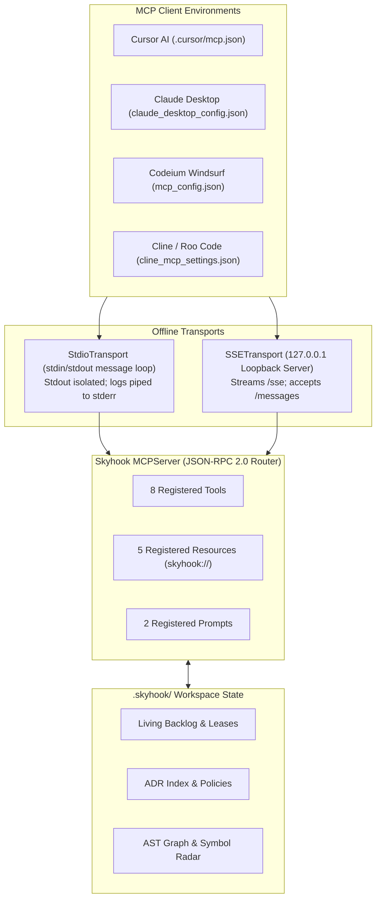

# Skyhook Model Context Protocol (MCP) Server

Skyhook provides a native, **100% offline Model Context Protocol (MCP)** server compliant with the official MCP specification (2024-11-05). It exposes project intelligence, living backlog tasks, architectural rules, and AST traceability directly into the runtime of AI coding agents.

---

## 1. Architectural Highlights



- **100% Air-Gapped & Offline**: Operates strictly on `process.stdin`/`process.stdout` or local loopback `127.0.0.1`. No data leaves your machine.
- **Pure JavaScript & Zero Compilation**: Zero native dependencies (`node-gyp` free).
- **Stream Isolation**: Console logging is redirected to `process.stderr` during active stdio sessions, ensuring `stdout` remains pure, uncorrupted JSON-RPC 2.0.

---

## 2. Quick Start & Client Configurations

Launch via the standalone binary:
```bash
skyhook-mcp
```
Or via the unified CLI:
```bash
skyhook mcp --stdio
```

### Cursor AI
Add to `.cursor/mcp.json`:
```json
{
  "mcpServers": {
    "skyhook": {
      "command": "node",
      "args": ["./node_modules/@skyhook/skill/skyhook/cli/skyhook-mcp.js"]
    }
  }
}
```
*Tip: Run `skyhook harness inject --target=cursor` to auto-configure this file.*

### Claude Desktop
Add to your OS-specific configuration:
- **macOS**: `~/Library/Application Support/Claude/claude_desktop_config.json`
- **Windows**: `%APPDATA%\Claude\claude_desktop_config.json`
- **Linux**: `~/.config/Claude/claude_desktop_config.json`

```json
{
  "mcpServers": {
    "skyhook": {
      "command": "node",
      "args": ["/ABSOLUTE/PATH/TO/skyhook/cli/skyhook-mcp.js"]
    }
  }
}
```

### Codeium Windsurf
Add to `.codeium/windsurf/mcp_config.json`:
```json
{
  "mcpServers": {
    "skyhook": {
      "command": "node",
      "args": ["./node_modules/@skyhook/skill/skyhook/cli/skyhook-mcp.js"]
    }
  }
}
```

---

## 3. Registered MCP Tools

### 1. `skyhook_get_next_task`
Acquires the next highest-priority ready story and issues an advisory agent lease.
- **Parameters**:
  - `assignee` (*string*): Name or ID of claiming agent (e.g. `"Cursor-Agent"`).
  - `epic` (*string, optional*): Filter tasks to a specific parent Epic.
- **Response**: Story details, WSJF priority, acceptance criteria, and lease TTL.

### 2. `skyhook_update_status`
Transitions a story across the backlog lifecycle (`backlog ➔ ready ➔ in-progress ➔ in-review ➔ done`).
- **Parameters**:
  - `storyId` (*string, required*): Target story ID (e.g. `"STORY-001"`).
  - `status` (*string, required*): Destination status.
  - `force` (*boolean, optional*): Override dependency blocking.

### 3. `skyhook_release_lease`
Explicitly releases an advisory lease without completing the task.
- **Parameters**:
  - `storyId` (*string, required*): Story ID to release.

### 4. `skyhook_record_decision`
Auto-synthesizes and indexes an Architectural Decision Record (ADR).
- **Parameters**:
  - `title` (*string, required*): Decision title.
  - `decision` (*string, required*): What was decided.
  - `context` (*string, optional*): Problem statement and rationale.

### 5. `skyhook_verify_policies`
Scans codebase imports and symbols against active ADR policies.
- **Parameters**:
  - `path` (*string, optional*): Subdirectory to verify (defaults to workspace root).
- **Response**: List of violations, offending files, and line numbers.

### 6. `skyhook_check_drift`
Analyzes package drift, DDD layer violations, and circular dependencies.
- **Parameters**:
  - `boundaries` (*boolean, optional*): Enforce DDD module layer checks.
  - `semantic` (*boolean, optional*): Run AST code hygiene checks.

### 7. `skyhook_trace_requirement`
Traces a requirement ID to code references, AST symbols, and user stories.
- **Parameters**:
  - `requirementId` (*string, required*): e.g. `"REQ-001"`.

### 8. `skyhook_get_context`
Returns unified project intelligence, active tech stack, and backlog status to prime the model context.
- **Parameters**: None.

---

## 4. Registered MCP Resources (`skyhook://`)

AI models can read persistent workspace state via standardized URI templates:

| URI | Content Description |
|---|---|
| `skyhook://backlog` | Real-time JSON list of all epics, stories, story points, and active agent leases. |
| `skyhook://plan` | Current content of the compiled living `PROJECT_PLAN.md`. |
| `skyhook://decisions` | Index of all accepted and active architectural decision records. |
| `skyhook://boundaries` | Active architectural module and DDD layer boundary configurations. |
| `skyhook://tech-stack` | Current declared technology stack from `tech-stack.yaml`. |

---

## 5. Registered Prompts

Skyhook registers standard prompt workflows for agent orientation:

1. **`task_kickoff`**:
   - Argument: `storyId` (*required*).
   - Injects the complete story specification, acceptance criteria, relevant ADR constraints, and target source files into the prompt.
2. **`architecture_review`**:
   - Injects active ADR boundary rules and prompts the model to perform an architectural review of recently modified files.

---

## 6. Testing & Manual Verification

You can test the MCP server directly by piping JSON-RPC 2.0 messages via stdin:

```bash
# Handshake test
echo '{"jsonrpc":"2.0","id":1,"method":"initialize","params":{"protocolVersion":"2024-11-05"}}' | node skyhook/cli/skyhook-mcp.js

# List tools
echo '{"jsonrpc":"2.0","id":2,"method":"tools/list","params":{}}' | node skyhook/cli/skyhook-mcp.js

# Execute tool
echo '{"jsonrpc":"2.0","id":3,"method":"tools/call","params":{"name":"skyhook_get_context","arguments":{}}}' | node skyhook/cli/skyhook-mcp.js
```
