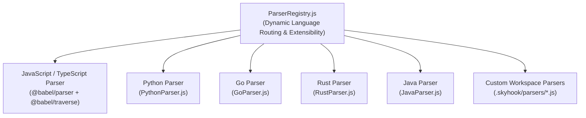

# Polyglot AST Traceability, Lineage & Dark Matter Radar

Skyhook features an advanced polyglot Abstract Syntax Tree (AST) engine capable of inspecting source code across multiple languages to guarantee bidirectional traceability between requirements, backlog stories, and codebase implementations.

---

## 1. Polyglot Language Parsers

Skyhook coordinates language-specific parsers through [`skyhook/lib/parsers/ParserRegistry.js`](file:///Users/asad/Documents/Codex/2026-08-29/wh/skyhook-repo/skyhook/lib/parsers/ParserRegistry.js).



### Supported Languages & Syntax Conventions

| Language | File Extensions | Annotation Syntax | Extracted Symbols |
|---|---|---|---|
| **JavaScript / TypeScript** | `.js`, `.mjs`, `.cjs`, `.jsx`, `.ts`, `.tsx` | `// @skyhook-implements REQ-001` | Functions, Async Functions, Classes, Methods, React Components |
| **Python** | `.py` | `# @skyhook-implements REQ-001` | Classes, Methods, `def`, `async def`, Decorators |
| **Go** | `.go` | `// @skyhook-implements REQ-001` | Package Functions, Receiver Methods, Structs, Interfaces |
| **Rust** | `.rs` | `/// @skyhook-implements REQ-001` | Structs, Enums, `impl` blocks, Functions |
| **Java** | `.java` | `@SkyhookImplements("REQ-001")` or `// @skyhook-implements` | Classes, Records, Interfaces, Methods |

---

## 2. Docblock & Annotation Standards

AI agents and developers link code to requirements by placing `@skyhook-implements` annotations immediately above target symbols:

### JavaScript / TypeScript:
```typescript
// @skyhook-implements REQ-001 REQ-002
export class PaymentProcessor {
  // @skyhook-implements REQ-003
  async processRefund(transactionId: string): Promise<Receipt> {
    // ...
  }
}
```

### Python:
```python
# @skyhook-implements REQ-004
class RiskEvaluator:
    # @skyhook-implements REQ-005
    def evaluate_credit_risk(self, account_id: str) -> float:
        pass
```

### Go:
```go
// @skyhook-implements REQ-006
func (s *Server) HandleTransaction(w http.ResponseWriter, r *http.Request) {
    // ...
}
```

### Rust:
```rust
/// @skyhook-implements REQ-007
pub struct LedgerEngine {
    state: LedgerState,
}
```

---

## 3. Symbol Lineage Tracker (Refactor Recovery)

When source files are moved or functions renamed, static string matching fails. Skyhook's [`SymbolLineageTracker.js`](file:///Users/asad/Documents/Codex/2026-08-29/wh/skyhook-repo/skyhook/lib/tracer/SymbolLineageTracker.js) computes an AST fingerprint based on:
1. Symbol name tokenization.
2. Parameter arity and signature characteristics.
3. Call-site tokens and cyclomatic complexity.

When an annotated symbol vanishes, Skyhook calculates Levenshtein distances and similarity scores across new unannotated symbols to suggest automated lineage recoveries:

```bash
$ skyhook trace REQ-001
⚠ Suggested Lineage / Refactored Recoveries:
┌───────────────────────┬──────────────────────────┬──────────────────────────┬────────────┐
│ File                  │ Old Symbol               │ Suggested Match          │ Confidence │
├───────────────────────┼──────────────────────────┼──────────────────────────┼────────────┤
│ src/ledger/Service.ts │ executeTransfer          │ executeAtomicTransfer    │ 92%        │
└───────────────────────┴──────────────────────────┴──────────────────────────┴────────────┘
```

---

## 4. Dark Matter Radar & Coverage Analysis

Untraced codebase symbols represent "dark matter"—code whose business justification and requirement backing are unknown to AI agents.

Run the radar:
```bash
skyhook dark-matter
```
Output:
```
ℹ AST Code Coverage: 84.2% (128/152 symbols traced)
ℹ Dark Matter (Untraced): 24 symbols across 6 files
┌───────────────────────┬──────────────────────────┬──────────────┬──────────┐
│ File                  │ Symbol                   │ Type         │ Risk Tier│
├───────────────────────┼──────────────────────────┼──────────────┼──────────┤
│ src/auth/Token.ts     │ rotateSecretKey          │ Function     │ CRITICAL │
│ src/utils/Format.ts   │ formatDateString        │ Function     │ LOW      │
└───────────────────────┴──────────────────────────┴──────────────┴──────────┘
```

### Risk Tier Definitions:
- **CRITICAL**: Untraced symbols in auth, crypto, security, or financial modules.
- **HIGH**: Untraced symbols in database, ORM, or network communication layers.
- **MEDIUM**: Untraced symbols in controllers or business domain logic.
- **LOW**: Untraced symbols in utility or formatting helpers.

---

## 5. Circular Dependency Detection (Tarjan's Algorithm)

[`ASTImportGraph.js`](file:///Users/asad/Documents/Codex/2026-08-29/wh/skyhook-repo/skyhook/lib/tracer/ASTImportGraph.js) resolves relative imports and path aliases (`@/`) across the repository, constructing a directed import graph.

It executes **Tarjan's algorithm** to identify strongly connected components, pinpointing circular dependency cycles:

```bash
$ skyhook drift --boundaries
⚠️ Warning: 1 circular dependency cycle(s) detected:
   Cycle 1: src/models/User.ts ➔ src/services/Auth.ts ➔ src/models/User.ts
```
