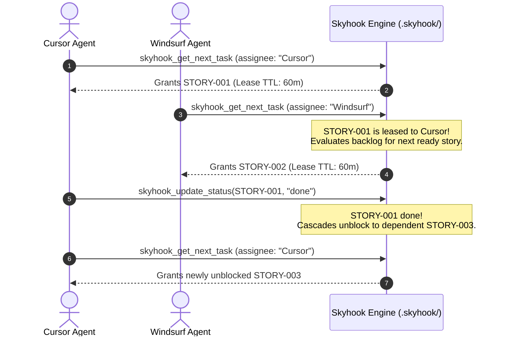

# Tutorial 2: Multi-Agent Task Coordination Without Collisions

When multiple autonomous agents (e.g. Cursor, Windsurf, Claude Code, and Copilot) work in the same repository simultaneously, they frequently step on each other by picking up identical tasks, causing git merge conflicts or duplicated work.

Skyhook solves this with **Advisory Task Leases**, **Automated Prerequisite Cascades**, and **Concurrency Locks**.

---

## 1. The Multi-Agent Coordination Flow



---

## 2. Practical Walkthrough

### Step 1: Populate Backlog with Dependencies
Create interdependent stories:
```bash
skyhook add-feature "Auth Microservice" --points 3
skyhook add-feature "Billing API" --points 5
```

### Step 2: Agent 1 Claims First Task
```bash
$ skyhook get-next-task --agent="Agent-Cursor"
✓ Acquired task STORY-001: Auth Microservice
ℹ Advisory lease active for: 60 minutes
```

### Step 3: Agent 2 Requests Task Concurrently
If a second agent requests a task, Skyhook detects the active lease on `STORY-001` and avoids collision:
```bash
$ skyhook get-next-task --agent="Agent-Windsurf"
✓ Acquired task STORY-002: Billing API
ℹ Advisory lease active for: 60 minutes
```

### Step 4: Inspect Active Leases in Dashboard
Open [http://127.0.0.1:31415/#/kanban](http://127.0.0.1:31415/#/kanban) to view the Kanban board:
- Pulsing neon ring on active stories.
- Live ticking countdown timers (`48m 12s remaining`).
- 1-click **Release Lease** button for human supervisors.

### Step 5: Completing Tasks and Automatic Unblocking
When Agent 1 finishes:
```bash
skyhook update-status STORY-001 done
```
Skyhook appends the completion event to `events.jsonl`, releases the lease, checks if any stories were waiting on `STORY-001`, and transitions unblocked stories to `ready`.
