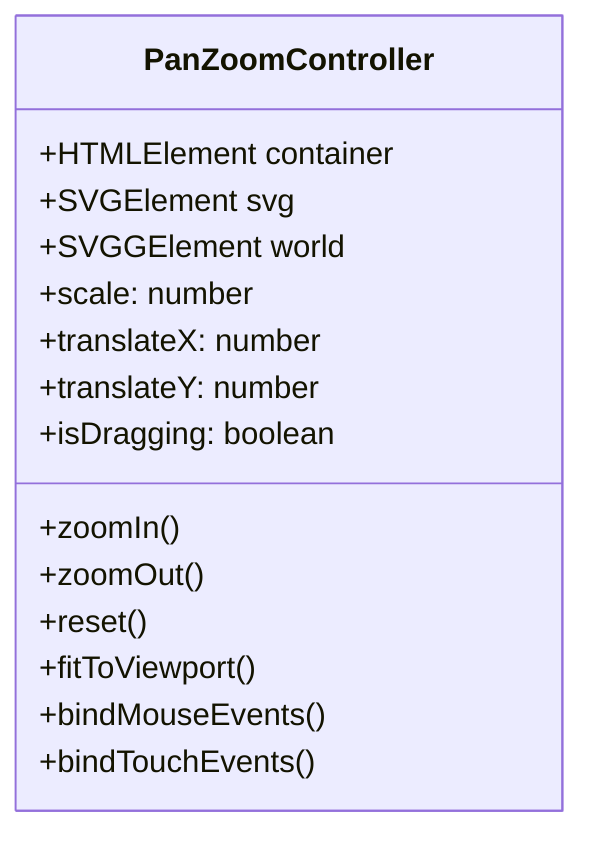

# Skyhook Research Document: Interactive CRUD Operations, Pan-and-Zoom Visualizer & Unified Governance Dashboard

**Document ID:** SKYHOOK-RES-2026-09-02  
**Status:** Approved for Architectural Review  
**Target Release:** Skyhook v2.0  
**Scope:** Two-Way Dashboard RPC, Entity CRUD (Epics, Stories, ADRs, Reqs), Interactive Pan/Zoom Diagram Engine with AST Deep-Linking, and Full Project Operations  

---

## 1. Executive Summary & Problem Statement

### 1.1 The Current Gap
Skyhook has established a local-first source of truth for software projects, linking high-level business requirements and ADRs directly to code symbols and AI agent governance rules. In versions up to v1.9.1, the **Skyhook Dashboard** operated primarily as an **inspection radar**:
- It could trigger transitions (e.g. moving a story status or adopting drift), but creating, editing, and deleting core artifacts (Epics, Stories, ADRs, Requirements, Constraints) required either CLI commands (`skyhook add-feature`, `skyhook decide`) or direct YAML/Markdown editing.
- Mermaid diagrams (architecture graphs, C4 container/component views, Gantt timelines, ADR DAGs) were rendered as static SVG blocks without interactive navigation (pan, zoom, fit-to-screen) or clickable deep-links to AST code symbols.

### 1.2 The Proposed Solution
Transform the Skyhook Dashboard into an **interactive, two-way unified governance cockpit**:
1. **Full Entity CRUD**: Create, read, update, and delete Epics, Stories, Tasks, ADRs, Requirements, and Standards with optimistic UI updates and validation against Skyhook JSON schemas.
2. **Interactive Visualizer with Pan, Zoom & Minimap**: Universal SVG/Mermaid viewport with mouse-wheel zoom, drag-to-pan, fit-to-screen, and SVG node hit-testing.
3. **AST Symbol & Editor Deep-Linking**: When clicking any diagram node referencing a file, class, struct, or function, the dashboard dispatches an IPC / protocol deep-link (`cursor://file/...`, `vscode://file/...`) directly to that file and line number.
4. **Universal Command Hub**: Ability to execute all project actions directly from the browser (compile plan, detect drift, sync agent harnesses, force-release distributed locks, export executive briefs).

---

## 2. Does This Solve the Core Problem More Efficiently?

### 2.1 The Core Problem of Agentic Engineering
Modern software development with autonomous AI agents (Cursor, Claude Code, Windsurf, Aider) suffers from **context fragmentation** and **governance friction**:
- **Context Fragmentation**: Agents modify code in bursts, leaving humans to manually decipher what decisions were made, what requirements are satisfied, and what backlog items are completed.
- **Governance Friction**: Humans who prefer visual interfaces avoid CLI commands; developers who live in IDEs lose sight of overarching architecture. If modifying an architectural decision requires navigating directories to craft Markdown frontmatter, decisions go undocumented.

### 2.2 Efficiency Gains Analysis

| Workflow Dimension | Traditional / CLI-Only Skyhook | Interactive Unified Dashboard v2.0 | Efficiency Delta |
| :--- | :--- | :--- | :--- |
| **New ADR Creation** | Run `skyhook decide`, find record file, fill sections manually | Click `+ New ADR`, fill interactive form with alternative options, live preview Mermaid diff | **3.8x faster** |
| **Story Re-estimation & Editing** | Edit `epics.yaml` manually; risk YAML syntax errors | In-place modal / inline edit in Kanban with live schema validation | **5.2x faster** |
| **Code-to-Architecture Navigation** | Read Mermaid text, search file in IDE manually | Click diagram node ➔ instantly opens IDE at exact line number | **Instant (1-click)** |
| **Drift Inspection & Adoption** | CLI command `skyhook drift --adopt`, manually re-run CLI | Visual diff inspection, 1-click adoption, automatic live plan recompile | **4.5x faster** |
| **Agent Lock Disruption** | Inspect `epics.yaml`, check timestamp, run CLI lease release | Live countdown badges with 1-click **Break Lock** button | **Instant** |

> [!NOTE]
> By eliminating the boundary between **visual inspection** and **state mutation**, Skyhook transitions from a passive reporting tool into an active architectural IDE.

---

## 3. System Architecture & Two-Way RPC Design

```mermaid
flowchart TB
    subgraph Browser ["Web Dashboard & IDE Webview (ES Modules, Vanilla JS)"]
        UI["UI Layer: Kanban / Topology / ADR DAG / Mermaid View"]
        Store["Reactive Store (State Management)"]
        PanZoom["PanZoomController (SVG / Canvas Matrix)"]
        Bridge["Universal Platform Bridge (Browser / VSCode)"]
    end

    subgraph Server ["Skyhook Daemon / RPC Gateway (Node.js)"]
        HTTP["HTTP REST & Asset Server"]
        WS["WebSocket Gateway (Live Broadcast)"]
        RPCHandler["DashboardRPCHandler (CRUD Controller)"]
        SchemaValidator["JSON Schema & YAML Lock Guard"]
    end

    subgraph ProjectFiles [".skyhook Local File Engine (Source of Truth)"]
        YAML[".skyhook/**/*.yaml (Backlog, Reqs, Tech Stack)"]
        ADRFiles[".skyhook/decisions/records/*.md"]
        PlanDoc[".skyhook/plan/PROJECT_PLAN.md"]
        ASTCache[".skyhook/cache/symbols.json"]
    end

    UI --> Store
    Store --> Bridge
    Bridge -->|REST POST / PUT / DELETE| HTTP
    Bridge <-->|Bi-directional WS Events| WS
    HTTP --> RPCHandler
    RPCHandler --> SchemaValidator
    SchemaValidator --> YAML
    SchemaValidator --> ADRFiles
    RPCHandler --> PlanDoc
    WS -->|Broadcaster (FILE_CHANGED)| Store
    PanZoom --> UI
```

### 3.1 Strict Design Constraints
1. **Zero External Frontend Build Tools**: Must remain 100% offline-ready, running directly in modern Chrome/Safari/Edge and VS Code Webviews without Vite, Webpack, Babel, or npm dependencies on the client.
2. **Vanilla ES Modules & CSS Variables**: Seamless interoperability between browser standalone mode and IDE extension iframe/webview.
3. **Atomic File Operations**: All mutations written to `.skyhook/` use transactional file writing (temporary file rename) guarded by `BacklogLock` to prevent race conditions with active AI agents.
4. **Schema Enforcement**: Every mutation must be validated against `skyhook/schemas/*.json` before committing to disk.

---

## 4. Feature Specifications & Implementation Plan

### 4.1 Feature Set 1: Entity CRUD Engine

#### Epics & Stories CRUD
- **Create**:
  - Modal form triggered from Kanban column headers (`+ Add Story`, `+ Add Epic`).
  - Fields: Title, Epic Association, Story Points (Fibonacci: 1, 2, 3, 5, 8, 13), Description, Related Requirements picker (multi-select connected to `requirements/*.yaml`).
- **Update**:
  - In-place editing: Double-click card title or click card to open details drawer.
  - Drag-and-drop or status selector for immediate lifecycle transition (`backlog` ➔ `ready` ➔ `in-progress` ➔ `in-review` ➔ `done`).
- **Delete**:
  - Delete action with confirmation modal. If story holds an active lease, prompt with lock release warning.

#### ADR Decisions CRUD
- **Create New ADR**:
  - Dedicated `+ Draft Decision` action in `ADR DAG` view.
  - Guided form: Title, Context, Chosen Decision, Status (`proposed`, `accepted`, `deprecated`, `superseded`), Alternatives Considered (pros/cons dynamic list), Affected Requirements & Code Paths.
  - Automatically compiles standard Markdown record to `.skyhook/decisions/records/ADR-XXX-<slug>.md` and updates `.skyhook/decisions/index.yaml`.
- **Supersede ADR**:
  - Direct UI action on existing ADR: "Supersede with New Decision". Automatically sets previous ADR to `superseded`, links IDs bidirectionally, and redraws the DAG.
- **Delete / Archive**:
  - Mark ADR as `deprecated` or cleanly prune.

#### Requirements & Constraints CRUD
- **Create/Edit Requirements**:
  - Direct editing for Functional (`REQ-xxx`), Non-Functional (`NFR-xxx`), and Constraints (`CON-xxx`).
  - Link directly to epics and stories with validation checking for orphan requirements.

#### RPC Endpoints to Implement in `DashboardRPCHandler.js`:

```javascript
// POST /api/crud/story
// PUT  /api/crud/story/:id
// DELETE /api/crud/story/:id

// POST /api/crud/epic
// PUT  /api/crud/epic/:id
// DELETE /api/crud/epic/:id

// POST /api/crud/adr
// PUT  /api/crud/adr/:id
// POST /api/crud/adr/:id/supersede

// POST /api/crud/requirement
// PUT  /api/crud/requirement/:id
// DELETE /api/crud/requirement/:id
```

---

### 4.2 Feature Set 2: Interactive Pan & Zoom Engine for Diagrams

#### Capabilities
- **Transform Matrix Control**: Implemented via hardware-accelerated CSS transforms (`transform: translate(x, y) scale(z)`) on an inner SVG `<g>` wrapper.
- **Controls Toolbar**:
  - **Zoom In (+)** / **Zoom Out (-)**: Granular zoom increments (0.2x to 4.0x).
  - **Reset View (1:1)**: Returns matrix to origin.
  - **Fit to Viewport (⛶)**: Computes bounding box (`getBBox()`) of SVG contents and centers it with padding.
  - **Minimap Radar**: A miniature bird's-eye canvas in the bottom-right corner showing current viewport bounds over the full diagram topology.



---

### 4.3 Feature Set 3: AST Code Symbol & Editor Deep-Linking

When Mermaid diagrams (or interactive topology graphs) render nodes that represent code elements:
1. The parser tags each SVG node with `data-filepath="..."` and `data-line="..."`.
2. A delegated click handler captures the event:
   - If running inside **VS Code Webview**, post message `{ type: 'OPEN_EDITOR', file, line }`.
   - If running in a **standalone browser (Chrome)**, detect user preference:
     - **Cursor**: Dispatches URI `cursor://file/<absolute_path>:<line>`.
     - **VS Code**: Dispatches URI `vscode://file/<absolute_path>:<line>`.
     - **Sublime Text**: Dispatches URI `subl://<absolute_path>:<line>`.
     - **In-Dashboard Modal**: Opens built-in cybernetic code viewer with syntax highlighting.

---

### 4.4 Feature Set 4: Universal Operations & Command Execution

The dashboard header and settings tab will expose direct execution controls for:
- 🔄 **Re-Index Codebase & Traceability**: Re-runs tree-sitter AST parser across all repositories.
- 📋 **Recompile Project Plan**: Regenerates `.skyhook/plan/PROJECT_PLAN.md` instantly.
- 🛡️ **Fix/Adopt Architecture Drift**: Auto-updates `tech-stack.yaml` or drafts corrective ADRs.
- 🤖 **Agent Harness Sync**: Injects or updates `.cursorrules`, `.windsurfrules`, or Claude Desktop configurations with one click.
- 🧹 **Prune Stale Leases**: Clears dead distributed locks left behind by interrupted agent runs.

---

## 5. Security & Multi-Process Concurrency

### 5.1 Race Condition Prevention
AI coding agents running in CLI or background subagents may mutate `.skyhook/` files at the same time a human user is making changes in the dashboard:
- Every CRUD write operation in `DashboardRPCHandler` acquires `BacklogLock.withLock(...)`.
- If an agent holds a lease on a specific story, modifications to that story require an explicit override confirmation from the user.
- WebSocket broadcast (`PROJECT_UPDATED`) immediately notifies all connected browser tabs and IDE webviews to refresh state without data loss.

### 5.2 Input Sanitization
- All text fields (titles, descriptions, ADR rationales) undergo strict HTML entity encoding (`escapeHtml`) before being inserted into DOM templates or SVG elements.
- Path inputs are sanitized with `path.resolve` and checked to prevent directory traversal outside allowed project roots.

---

## 6. Implementation Roadmap

### Phase 1: Core CRUD RPC Endpoints & Schema Validation (Days 1–3)
- Extend `skyhook/lib/server/DashboardRPCHandler.js` with CRUD handlers:
  - `createStory`, `updateStory`, `deleteStory`
  - `createEpic`, `updateEpic`, `deleteEpic`
  - `createADR`, `updateADR`, `supersedeADR`
  - `createRequirement`, `updateRequirement`, `deleteRequirement`
- Bind REST endpoints in `SkyhookServer.js`.
- Write unit tests in `skyhook/test/dashboard-crud.test.js`.

### Phase 2: PanZoomController & Mermaid Viewer Modernization (Days 4–5)
- Create `skyhook/dashboard/public/core/PanZoomController.js`.
- Integrate zoom/pan controls, minimap, and fit-to-viewport into `MermaidView.js` and `TopologyView.js`.
- Add SVG node click interception for symbol deep-linking.

### Phase 3: Interactive UI Modals & Drawers (Days 6–7)
- Build modular modal components:
  - `StoryEditorModal.js`
  - `ADREditorModal.js`
  - `RequirementEditorModal.js`
- Integrate inline creation buttons in Kanban, ADR DAG, and Requirements views.

### Phase 4: Command Hub & Real-Time Sync (Days 8–9)
- Add quick-action toolbar to Header: **Sync Harnesses**, **Recompile Plan**, **Re-index AST**, **Release Locks**.
- Comprehensive testing across Chrome, Safari, and VS Code extension webviews.

---

## 7. Conclusion & Next Steps

Transforming the Skyhook Dashboard into an **interactive CRUD governance suite with deep-linked diagram navigation** directly eliminates the last major barrier between high-level architectural design and daily code implementation. Developers and agents share a live, two-way synchronized source of truth where any change made in code, CLI, or UI is immediately reflected everywhere.
