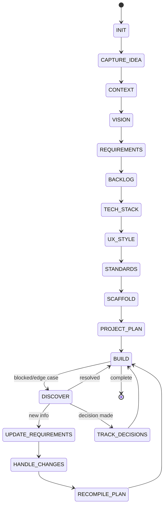

# Skyhook Project Lifecycle Workflow

## Overview

The complete project lifecycle from vague idea to maintained production system,
with continuous knowledge synchronization.

## Lifecycle Phases

### Phase 1: INIT — Initialize Skyhook

**Trigger**: New project or first Skyhook run in existing project

**Actions**:
1. Create `.skyhook/` directory structure
2. Initialize `project.yaml` with detected/basic info
3. Create empty schema-compliant files for all domains
4. Initialize git tracking for `.skyhook/`
5. Write `.skyhook/.gitignore`

**Outputs**: Empty but valid `.skyhook/` structure

**Agent Prompt**:
> "I'll initialize Skyhook for this project. Let me first explore the repository to understand what we're working with."

---

### Phase 2: CAPTURE_IDEA — Capture Initial Concept

**Trigger**: After init, or when user provides project idea

**Actions**:
1. Record raw idea in `context.md`
2. Extract: problem, solution, target users, value proposition
3. Identify explicit requirements from user statement
4. Flag assumptions and ambiguities

**Questions** (only if not provided):
- "What problem does this solve?"
- "Who is this for?"
- "What's the core value proposition?"

**Outputs**: `context.md` with structured idea capture

---

### Phase 3: CONTEXT — Gather Business Context

**Trigger**: Idea captured

**Actions**:
1. Document business context (market, competitors, constraints)
2. Identify stakeholders and their concerns
3. Record regulatory/compliance requirements
4. Note budget, timeline, team constraints
5. Document existing systems/integrations

**Questions** (contextual):
- "Are there regulatory requirements (GDPR, HIPAA, SOC2)?"
- "What's the timeline for MVP?"
- "Any existing systems to integrate with?"
- "Team size and expertise?"

**Outputs**: Updated `context.md`

---

### Phase 4: VISION — Define Product Vision

**Trigger**: Context established

**Actions**:
1. Write vision statement in `vision.md`
2. Define measurable success metrics (KPIs)
3. Identify non-goals (explicitly out of scope)
4. Define target personas
5. Outline high-level user journeys

**Questions**:
- "What does success look like in 6 months? 1 year?"
- "Any explicit non-goals for MVP?"
- "Primary user personas?"

**Outputs**: `vision.md` with vision, metrics, personas, journeys

---

### Phase 5: REQUIREMENTS — Elicit & Structure Requirements

**Trigger**: Vision defined

**Actions**:
1. **Functional Requirements**: User stories, use cases, features
2. **Non-Functional Requirements**: Performance, security, accessibility, etc.
3. **Constraints**: Technical, business, regulatory, budget
4. Prioritize using MoSCoW or WSJF
5. Link to vision metrics

**Questioning Strategy**:
- Use profile-specific question templates
- Ask only what's needed for current phase
- Infer from context when possible
- Offer standards-based defaults

**Outputs**: 
- `requirements/functional.yaml`
- `requirements/non-functional.yaml`
- `requirements/constraints.yaml`

---

### Phase 6: BACKLOG — Create Prioritized Work Items

**Trigger**: Requirements baselined

**Actions**:
1. Group requirements into epics
2. Break epics into user stories
3. Define acceptance criteria
4. Estimate effort (story points / t-shirt)
5. Prioritize using configured method (WSJF default)
6. Identify dependencies and sequencing

**Outputs**:
- `backlog/epics.yaml`
- `backlog/stories.yaml`
- `backlog/tasks.yaml`

---

### Phase 7: TECH_STACK — Select Technology Stack

**Trigger**: Backlog created, architecture decisions needed

**Actions**:
1. For each category, evaluate options against requirements
2. Document rationale for each choice
3. Record alternatives considered
4. Note constraints and risks
5. Define configuration decisions

**Categories**:
- Language & Runtime
- Framework (frontend/backend)
- Database & ORM
- Authentication
- Hosting & Deployment
- CI/CD
- Testing
- Monitoring
- Additional services

**Questions** (only undecided categories):
- Use profile recommendations as defaults
- Ask about team expertise constraints
- Consider operational preferences

**Outputs**: `tech-stack.yaml`

---

### Phase 8: UX_STYLE — Define UX & Design System

**Trigger**: Requirements known, UI work upcoming

**Actions**:
1. Define design direction (from questioning or inference)
2. Create color system (palette + semantic + dark mode)
3. Define spacing, typography, border radius scales
4. Specify shadows, transitions, z-index
5. Define breakpoints
6. Specify core components (or adopt library)
7. Document UX patterns

**Questions**:
- "Design direction preference?" (with visual references)
- "Component library or custom?"
- "Dark mode required?"
- "Animation preferences?"
- "Accessibility target?" (default WCAG 2.1 AA)

**Outputs**:
- `ux/styleguide.md` (full design system)
- `ux/components.yaml`
- `ux/patterns.yaml`

---

### Phase 9: STANDARDS — Configure Project Standards

**Trigger**: Tech stack selected, team preferences known

**Actions**:
1. Load built-in standards for project type
2. Present as defaults to user/team
3. Record overrides in `.skyhook/standards/`
4. Configure linting, formatting, git hooks
5. Define review/approval processes

**Standards Domains**:
- Software (code quality, architecture)
- Security (OWASP, secure defaults)
- Testing (unit, integration, e2e strategies)
- Accessibility (WCAG level, testing)
- Performance (budgets, monitoring)
- Documentation (ADRs, API docs, README)

**Outputs**:
- `.skyhook/standards/software.md`
- `.skyhook/standards/security.md`
- `.skyhook/standards/testing.md`
- `.skyhook/standards/accessibility.md`
- `.skyhook/standards/documentation.md`
- Config files (eslint, prettier, husky, etc.)

---

### Phase 10: SCAFFOLD — Generate Starter Code

**Trigger**: Tech stack finalized, standards set

**Actions**:
1. Generate folder structure
2. Create configuration files
3. Set up build/lint/test scripts
4. Create example components/pages
5. Set up CI/CD pipeline
6. Initialize database schema (if applicable)
7. Create README with setup instructions

**Outputs**: Project scaffold in repository (not in `.skyhook/`)

---

### Phase 11: PROJECT_PLAN — Generate Comprehensive Plan

**Trigger**: Scaffold complete, backlog prioritized

**Actions**:
1. Synthesize all `.skyhook/` knowledge into `PROJECT_PLAN.md`
2. Include: vision, requirements, architecture, tech stack, UX, backlog, timeline
3. Define milestones and deliverables
4. Identify risks and mitigations
5. Document open questions and decisions needed

**Outputs**: `.skyhook/plan/PROJECT_PLAN.md`

---

### Phase 12: BUILD — Implement Features

**Trigger**: Plan approved

**Ongoing Process**:
```
For each story/task:
  1. Read relevant context from .skyhook/
  2. Check for decisions affecting this work
  3. Identify missing information
  4. If critical gap → ask targeted question
  5. Implement following standards
  6. Record any decisions made during implementation
  7. Update requirement status
  8. Verify against acceptance criteria
```

**Key Principle**: `.skyhook/` is the source of truth during build

---

### Phase 13: DISCOVER — Continuous Discovery

**Trigger**: During build (blockers, edge cases, feedback)

**Actions**:
1. When blocked → identify missing knowledge
2. When edge case found → document as requirement/decision
3. When user feedback received → update requirements
4. When technical discovery made → update tech stack/decisions

**Question Generation**:
- Only ask what's needed to unblock current work
- Use contextual question templates
- Offer defaults from standards

---

### Phase 14: UPDATE_REQUIREMENTS — Evolve Requirements

**Trigger**: Discovery made, scope change, pivot

**Actions**:
1. Modify requirement (status, priority, description)
2. Add new requirements
3. Mark superseded requirements
4. Maintain traceability (why changed, what triggered)
5. Update backlog priorities
6. Regenerate affected plans

**Change Tracking**:
- Every change recorded in `changelog.md`
- Superseded items preserved with reason
- Decision links maintained

---

### Phase 15: TRACK_DECISIONS — Record Decisions

**Trigger**: Any architectural/design decision made

**Actions**:
1. Create ADR in `.skyhook/decisions/`
2. Link to related requirements
3. Document alternatives considered
4. Record consequences (positive/negative/neutral)
5. Update decisions index

**When to Create ADR**:
- Technology choice
- Architecture pattern
- Data model change
- Security approach
- UX pattern adoption
- Performance trade-off
- Library/framework selection

---

### Phase 16: HANDLE_CHANGES — Manage Change

**Trigger**: Requirement change, priority shift, pivot

**Actions**:
1. Assess impact (requirements, backlog, plan, code)
2. Identify affected work items
3. Communicate impact to stakeholders
4. Update all affected artifacts
5. Record change in changelog
6. Regenerate project plan

**Change Categories**:
- Scope addition/removal
- Priority reordering
- Technical approach change
- Timeline adjustment
- Team/resource change

---

### Phase 17: RECOMPILE_PLAN — Regenerate Project Plan

**Trigger**: Significant changes, milestone, on-demand

**Actions**:
1. Read current state from all `.skyhook/` files
2. Synthesize into updated `PROJECT_PLAN.md`
3. Highlight what changed since last version
4. Update timeline/milestones
5. Re-assess risks

**Frequency**:
- After each major milestone
- When >3 requirements change
- When >2 decisions added
- On explicit request

---

## Phase Transitions



## Entry Points

Agents can enter at any phase based on project state:

| Project State | Entry Phase |
|---------------|-------------|
| Empty directory | INIT |
| Idea only | CAPTURE_IDEA |
| Some context | CONTEXT |
| Vision doc exists | VISION |
| Requirements doc | REQUIREMENTS |
| Backlog exists | BACKLOG |
| Tech chosen | TECH_STACK |
| Design system | UX_STYLE |
| Code exists | BUILD (with discovery) |

## Skip Conditions

Phases can be skipped if:
- Information already exists in `.skyhook/`
- User explicitly says "skip"
- Profile provides complete defaults
- Non-applicable to project type

## Completion Criteria

Each phase has explicit done criteria:

```yaml
phaseCompletion:
  INIT:
    - .skyhook/ exists with all directories
    - project.yaml valid
    - git tracking initialized
  
  CAPTURE_IDEA:
    - context.md has problem/solution/users/value
  
  CONTEXT:
    - Business context documented
    - Constraints identified
  
  VISION:
    - vision.md has statement, metrics, personas, journeys
  
  REQUIREMENTS:
    - Functional reqs cover core features
    - NFRs cover perf/sec/a11y
    - Constraints documented
    - All confirmed by user
  
  BACKLOG:
    - Epics cover all functional areas
    - Stories have acceptance criteria
    - Prioritized
  
  TECH_STACK:
    - All categories decided
    - Rationale documented
  
  UX_STYLE:
    - Styleguide complete (colors, type, spacing, components)
    - Patterns documented
  
  STANDARDS:
    - All domains configured
    - Tooling set up
  
  SCAFFOLD:
    - Project builds and runs
    - Tests pass
    - CI configured
  
  PROJECT_PLAN:
    - Comprehensive plan generated
    - Stakeholder approved
```

## Continuous Synchronization

### Sync Triggers

```yaml
syncTriggers:
  - onCommit: "If syncOnCommit enabled"
  - onPR: "Pre-merge validation"
  - onRelease: "Version bump, changelog"
  - onDemand: "Manual skyhook sync"
  - scheduled: "Daily/weekly drift check"
```

### Sync Checks

```yaml
syncChecks:
  - requirementsVsCode: "Do implemented features match requirements?"
  - decisionsVsCode: "Are architectural decisions reflected in code?"
  - planVsReality: "Does plan match actual progress?"
  - docsVsCode: "Is documentation current?"
  - standardsCompliance: "Does code follow configured standards?"
```

### Drift Resolution

```yaml
driftResolution:
  minor: "Auto-update documentation"
  major: "Flag for human review"
  conflict: "Surface decision needed"
```
